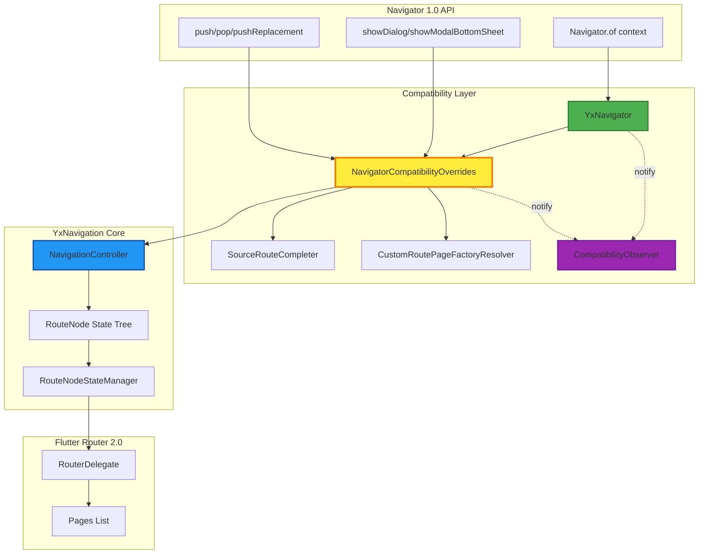
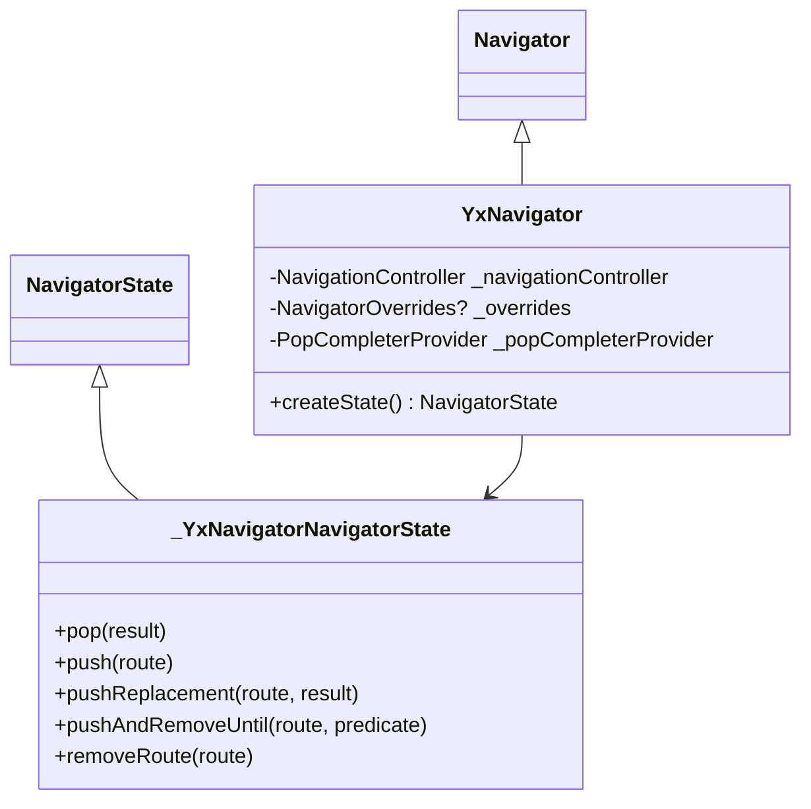
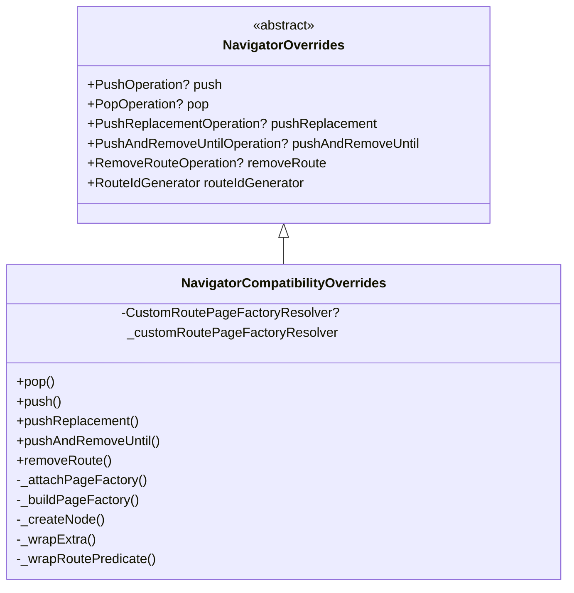
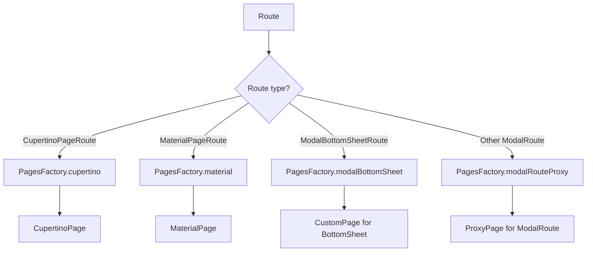
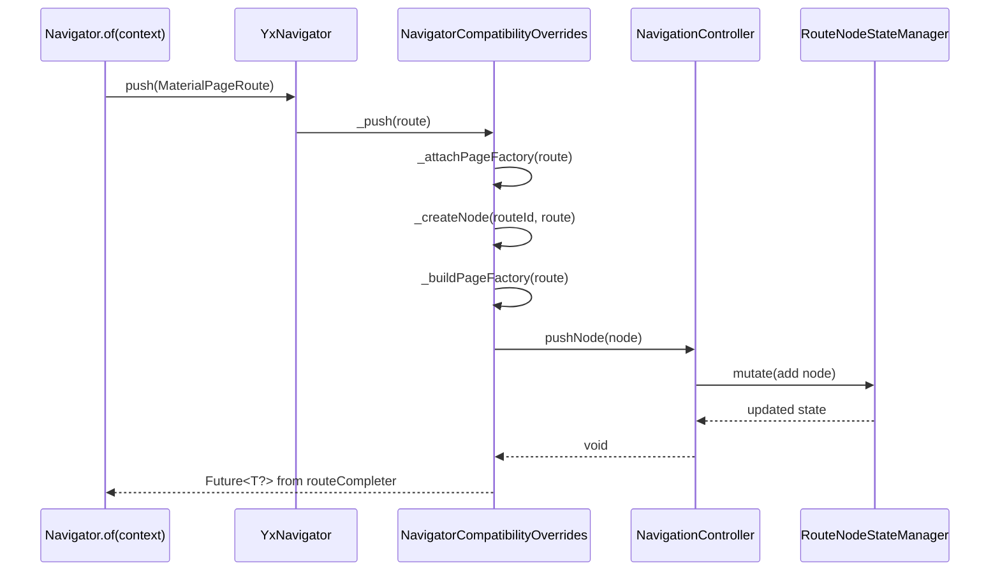
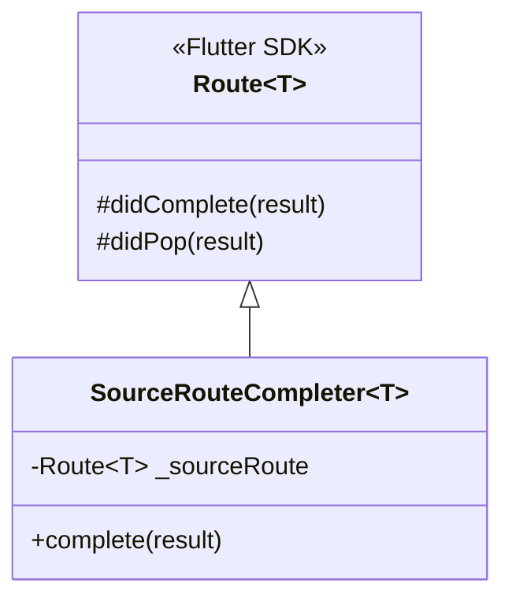
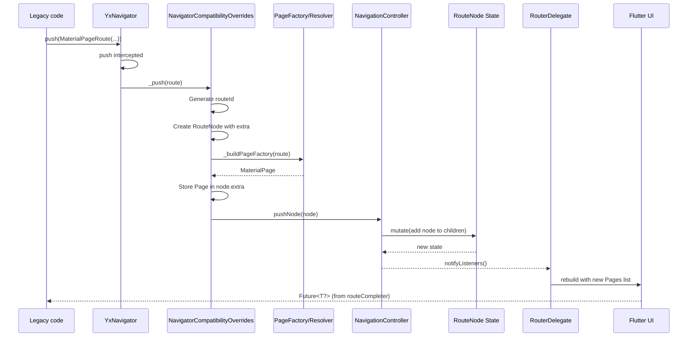
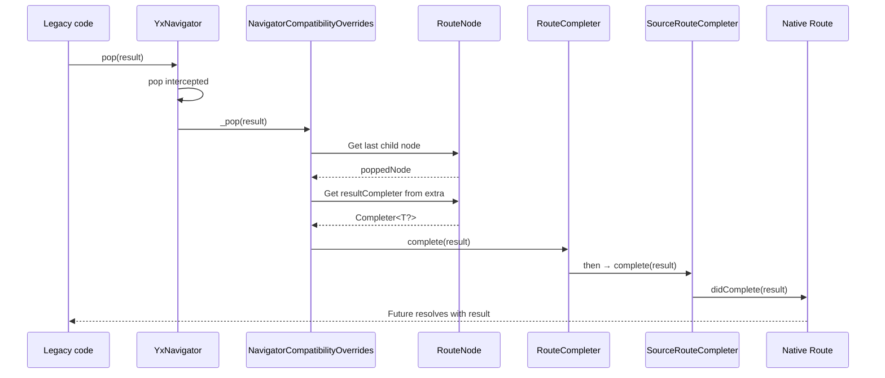
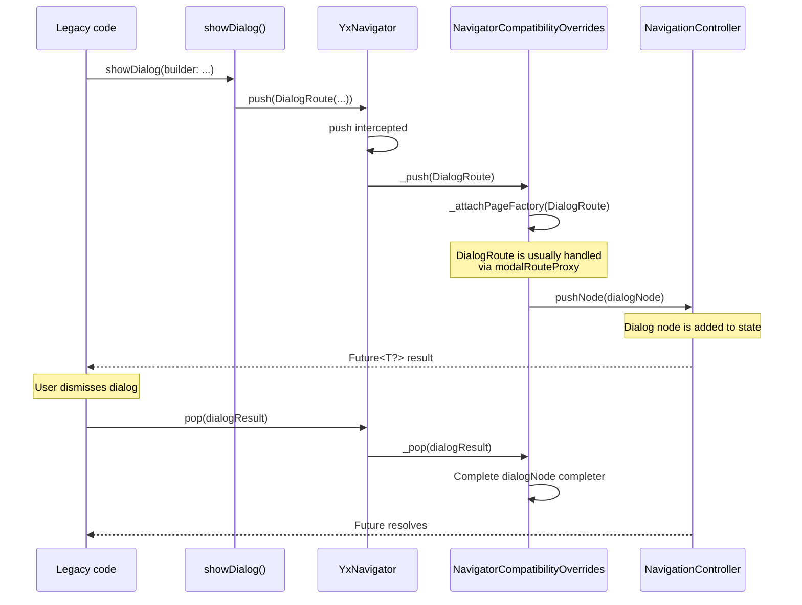

# Compatibility mechanism architecture

This document covers:

- Introduction
- Terminology
- Problem
- Solution architecture (updated diagram)
- 1. YxNavigator
- 2. NavigatorCompatibilityOverrides
- 3. SourceRouteCompleter
- 4. CustomRoutePageFactoryResolver
- 5. BackButtonListenableRouter
- 6. CompatibilityObserver — monitoring and observability
  - Architecture
  - When events fire
  - Passing the observer
  - Usage examples
  - App integration
  - Use cases
- Data flow
- App integration (updated)
- Limitations and caveats
- Conclusion
- See also

## Introduction

The **Compatibility** mechanism in yx_navigation provides backward compatibility with the Navigator
1.0 API. It lets you integrate existing code that uses `Navigator.of(context).push()`,
`showDialog()`, `showModalBottomSheet()`, and other Navigator 1.0 methods that create **anonymous
routes** (routes without an explicit declaration) into apps built on yx_navigation declarative
navigation (Navigator 2.0).

**⚠️ Known limitations:** details on unsupported APIs (including `PopupMenuRoute` / `showMenu`) are
later in [§ 2. NavigatorCompatibilityOverrides](#2-navigatorcompatibilityoverrides) → **Not supported**.

## Terminology

### Anonymous routes (pageless routes)

Routes created directly through Navigator 1.0 API without declarative `Page` objects:

```dart
Navigator.of(context).push(MaterialPageRoute(...)); // Anonymous route
showDialog(context: context, ...);                   // Anonymous route
```

### Page-based routes

Routes created from `Page` objects via the Navigator 2.0 declarative approach:

```dart
RouteDeclaration.routeBuilder(
  route: AppRoutes.profile,
  routeBuilder: RouteBuilder.widget(...), // Page-based route
);
```

## Problem

### Which Navigator 1.0 operations work without Compatibility?

Most basic Navigator 1.0 operations **work correctly** with yx_navigation without extra setup:

✅ **Supported:**

- `Navigator.of(context).push(Route)` - push a new route
- `Navigator.of(context).pop([result])` - pop current route
- `Navigator.of(context).canPop()` - whether pop is possible
- `Navigator.of(context).maybePop([result])` - best-effort pop

They work because they **do not rewrite the existing route stack** - they only append or remove the
top entry.

### Which operations fail without Compatibility?

❌ **Unsupported (assert):**

- `Navigator.of(context).pushReplacement(Route)` - replace current route
- `Navigator.of(context).pushAndRemoveUntil(Route, predicate)` - remove routes by predicate
- `Navigator.of(context).removeRoute(Route)` - remove a specific mid-stack route
- `Navigator.of(context).replace(oldRoute, newRoute)` - replace a specific route
- `Navigator.of(context).replaceRouteBelow(anchorRoute, newRoute)` - replace below anchor

### Why do these fail without Compatibility?

**Historical context:**

Flutter's `Navigator` recognizes two route kinds:

- **Page-based routes** - built from `Page` objects (Navigator 2.0, declarative)
- **Pageless routes** - created via `push` / `showDialog` (Navigator 1.0, anonymous)

This split appeared when Flutter moved to declarative navigation (Flutter 3.0+). Before that, all
routes were pageless.

**Why they clash:**

`Navigator` manages its **internal route stack** in two ways:

1. **Page-based routes:** stack is driven by `Navigator.pages`

   - When `pages` changes, `Navigator` syncs its internal stack
   - Replace-style operations mutate the `pages` list

2. **Pageless routes:** stack is mutated directly through `Navigator` methods

   - Routes are added/removed imperatively
   - There is no sync with the `pages` property

**Mixing conflict:**

When the stack contains page-based routes (from `RouteDeclaration`) and you run a replace operation
with a pageless route (`MaterialPageRoute`), `Navigator` detects **desync**:

```dart
// From flutter/lib/src/widgets/navigator.dart
void pushReplacement<T extends Object?, TO extends Object?>(...) {
  final Page<dynamic>? oldPage = _oldPage; // Current page-based page

  // Problem: new route is pageless, old route is page-based!
  if (oldPage != null && newRoute is! Page) {
    // ❌ ASSERT: Cannot mix page-based and pageless routes in replace operations!
    assert(() {
      throw FlutterError.fromParts(<DiagnosticsNode>[
        ErrorSummary('Cannot replace a page-based route with a pageless route.'),
        ErrorDescription(
          'The navigator has a page-based route "${oldPage.name}" but you are '
          'trying to replace it with a pageless route.'
        ),
      ]);
    }());
  }

  // ... remaining logic
}
```

**Why Flutter blocks this:**

1. **Lifecycle:** page-based routes are owned through `Navigator.pages`; replacing them must go
   through declarative state (the `pages` list). Replacing a page-based route with pageless breaks
   that contract.

2. **State sync:** Flutter must keep declarative `Navigator.pages` and imperative operations
   consistent. Mixing route kinds desynchronizes them.

3. **Predictability:** in declarative navigation, state is the single source of truth. Allowing
   replace across incompatible route kinds would violate that.

**In yx_navigation:**

All declarative routes (from `RouteDeclaration`) are **page-based** because yx_navigation is built on
Navigator 2.0. When legacy code calls `pushReplacement` with a new `MaterialPageRoute` (pageless),
`Navigator` detects the mix and asserts.

**Compatibility mode fixes this** by wrapping anonymous routes in `Page` objects and syncing them
with declarative navigation state so they behave like page-based routes.

## Solution architecture

### Overview diagram



### Key components

1. **YxNavigator** - intercepts Navigator 1.0 operations and handles `UnsupportedRouteException`
2. **NavigatorCompatibilityOverrides** - adapts Navigator 1.0 operations for yx_navigation
3. **SourceRouteCompleter** - completes routes correctly and returns results
4. **CustomRoutePageFactoryResolver** - extension point for custom `Route` types
5. **BackButtonListenableRouter** - wires the system back button for the root `Router`
6. **CompatibilityObserver** - lifecycle monitoring for pageless routes (willPush / didCreate / didFail)
7. **RouteNodeCompatibilityExtension** - distinguishes page-based vs pageless routes

## 1. YxNavigator

Extension of Flutter's `Navigator` that intercepts navigation operations.



**Responsibilities:**

- Intercepts `push`, `pop`, `pushReplacement`, `pushAndRemoveUntil`, `removeRoute`
- Delegates to `NavigatorOverrides` when configured
- Bridges Navigator 1.0 API and yx_navigation

## 2. NavigatorCompatibilityOverrides

Central compatibility-layer component that adapts Navigator 1.0 operations.



**Key methods:**

### `_attachPageFactory`

Creates a `RouteNode` for an imperative `Route`:

```dart
RouteNode _attachPageFactory<T>({
  required Route<T> route,
  required BuildContext context,
  required NavigatorState navigator,
  required Completer<T?> routeCompleter,
  required NavigationController navigationController,
}) {
  // 1. Generate unique routeId
  final routeId = routeIdGenerator.call(...);

  // 2. Create RouteNode with extra fields
  final node = _createNode(routeId: routeId, route: route);

  // 3. Create SourceRouteCompleter for route completion
  final sourceRouteCompleter = SourceRouteCompleter<T>(route);

  // 4. Create Page via PageFactory or CustomResolver
  final page = customRoutePageFactoryResolver?.resolvePage(...)
              ?? _buildPageFactory(...);

  // 5. Store Page and Completer in node.extra
  node.extra[pageFactoryExtraKey] = page;
  node.extra[completerExtraKey] = routeCompleter;

  return node;
}
```

### `_buildPageFactory`

Builds the correct `Page` type for a given `Route`:



**Supported `Route` types:**

### Specialized adapters (behavior preserved)

#### 1-3. `PageRoute` types (full-screen navigation)

1. `MaterialPageRoute` → `MaterialPage`
   - fullscreenDialog, allowSnapshotting, maintainState

2. `CupertinoPageRoute` → `CupertinoPage`
   - title, fullscreenDialog, allowSnapshotting, maintainState

3. `ModalBottomSheetRoute` → `ModalBottomSheetPage`
   - 15+ parameters (isScrollControlled, backgroundColor, shape, etc.)

#### 4-7. `PopupRoute` types (overlay above content)

4. `DialogRoute` (`showDialog`) → `DialogRoutePage`
   - ✅ centering, useSafeArea, anchorPoint

5. `CupertinoDialogRoute` (`showCupertinoDialog`) → `CupertinoDialogRoutePage`
   - ✅ iOS-style dialog behavior
   - ⚠️ **Note:** extends `RawDialogRoute`, matched earlier in the chain

6. `CupertinoModalPopupRoute` (`showCupertinoModalPopup`) → `CupertinoModalPopupRoutePage`
   - ✅ slide-up from bottom, semanticsDismissible

7. `RawDialogRoute` (`showGeneralDialog`, direct push) → `RawDialogRoutePage`
   - ✅ custom pageBuilder, transitionBuilder
   - ⚠️ **Checked after** `CupertinoDialogRoute`

### ❌ Not supported

8. `PopupMenuRoute` (`showMenu`) — **runs in native mode** (bypasses compatibility layer)
   - ❌ **Private class in Flutter SDK** — no public constructor
   - ❌ Cannot build a specialized adapter (constructor not accessible)
   - ❌ Cannot wrap in `PageRouteBuilder` (overlay / positioning conflicts with full-screen layout)
   - **How it works:** `_buildPageFactory` returns `null` → `_attachPageFactory` throws
     `UnsupportedRouteException` → `YxNavigator.push()` catches and delegates to `super.push()` (native
     Navigator)
   - **Status:** Works as a **pageless route** (not integrated with yx_navigation state)
   - ⚠️ **Critical limitation:**

   ```dart
   // ✅ OK:
   await showMenu(...);
   Navigator.of(context).pop(); // OK

   // ❌ NOT OK (assert about mixing page-based and pageless):
   await showMenu(...);
   Navigator.of(context).pushReplacement(...); // ❌ CRASHES!
   Navigator.of(context).replace(...);          // ❌ CRASHES!

   // Reason: showMenu creates a pageless route, while pushReplacement
   // expects page-based routes. Navigator will assert:
   // "The following assertion was thrown:
   //  The following RouteSettings has no Page: RouteSettings(...)"
   ```

   - 💡 **Recommended alternatives:**
     - `PopupMenuButton` (widget with built-in support)
     - `DropdownButton` (for list selection)
     - Custom overlay widgets (for complex cases)
     - `CustomRoutePageFactoryResolver` (for critical legacy needs)

### Fallback via `PageRouteBuilder` (for custom `ModalRoute`)

9. Custom `ModalRoute` (non-`PopupRoute`) → `PageRouteBuilder`
   - ✅ Works for custom full-screen `ModalRoute`
   - ❌ Does **not** work for custom `PopupRoute` (overlay / positioning conflict)
   - 💡 For custom `PopupRoute`: use `CustomRoutePageFactoryResolver` or stay in native mode

### ⚠️ Important: type check order

```dart
// ✅ Correct order:
if (route is DialogRoute) { ... }              // Priority 4
if (route is CupertinoDialogRoute) { ... }     // Priority 5 (extends RawDialogRoute)
if (route is CupertinoModalPopupRoute) { ... } // Priority 6
if (route is RawDialogRoute) { ... }           // Priority 7 (base class)
// PopupMenuRoute check removed - private class
```

**Why:** `CupertinoDialogRoute extends RawDialogRoute`

**Resolution order:**

1. `CustomRoutePageFactoryResolver` (if provided)
2. Specialized adapters (priorities 1-7) ⭐ **7 types**
3. Fallback to `modalRouteProxy` (for custom `ModalRoute`, except `PopupRoute`)
4. Bypass compatibility (unsupported cases, e.g. `PopupMenuRoute`)

**⚠️ Note:** `PopupMenuRoute` (`showMenu`) is **not** supported by the compatibility layer (private
class); it runs in native mode via `super.push()`.

### push Operation



### pushReplacement Operation

```dart
Future<T?> _pushReplacement<T, TO>({
  required Route<T> route,
  required BuildContext context,
  required NavigatorState navigator,
  required PopCompleterProvider popCompleterProvider,
  required NavigationController navigationController,
  TO? result,
}) async {
  // 1. Wait for previous pop operation to finish
  final popCompleter = popCompleterProvider();
  if (popCompleter != null && !popCompleter.isCompleted) {
    await popCompleter.future;
  }

  // 2. Create node for the new route
  final routeCompleter = Completer<T?>();
  final node = _attachPageFactory<T>(...);

  // 3. Replace last stack entry
  navigationController.mutate((routeNode) {
    routeNode.upsertLast(node); // Replaces last child
    return routeNode;
  });

  return routeCompleter.future;
}
```

## 3. SourceRouteCompleter

Solves completion for imperative `Route` instances.



**The `didPop` problem:**

`didPop` behaves differently across `Route` subclasses:

```dart
// Route (base class)
bool didPop(T? result) {
  didComplete(result);
  return true;
}

// CupertinoPageRoute
bool didPop(T? result) {
  if (hasLocalHistory) {
    handleLocalHistory();
    return false; // didComplete is NOT called!
  }
  return super.didPop(result);
}

// ModalRoute
bool didPop(T? result) {
  if (hasPendingPopScope) {
    handlePopScope();
    return false; // didComplete is NOT called!
  }
  return super.didPop(result);
}
```

**Solution:**

`SourceRouteCompleter` extends `Route` and calls `didComplete()` on the original route directly,
bypassing the complex `didPop` branching.

```dart
class SourceRouteCompleter<T> extends Route<T> {
  final Route<T> _sourceRoute;

  SourceRouteCompleter(this._sourceRoute);

  // Always forwards didComplete to the wrapped route
  void complete(T? result) => _sourceRoute.didComplete(result);
}
```

## 4. CustomRoutePageFactoryResolver

Interface for custom handling of `Route` types not covered out of the box.

```dart
abstract class CustomRoutePageFactoryResolver {
  /// Whether this resolver can handle the given Route
  bool hasResolverFor<T>(Route<T> route);

  /// Builds a Page for a custom Route
  Page<Object?> resolvePage<T>({
    required Completer<T?> routeCompleter,
    required Route<T> route,
    required LocalKey key,
  });
}
```

### Why `CustomRoutePageFactoryResolver`?

`NavigatorCompatibilityOverrides` supports standard `Route` types:

- `MaterialPageRoute`
- `CupertinoPageRoute`
- `ModalBottomSheetRoute`
- Any `ModalRoute` via `modalRouteProxy`

Real apps often introduce custom `Route` types:

- custom transition animations
- route-specific parameters (e.g. analytics)
- third-party libraries with their own `Route` classes

### Real-world example

An app uses `PageLessRoutePageFactoryResolver` for a custom `CustomModalRoute`.

```dart

final class PageLessRoutePageFactoryResolver
    implements CustomRoutePageFactoryResolver {

  const PageLessRoutePageFactoryResolver();

  @override
  bool hasResolverFor<T>(Route<T> route) {
    if (route is CustomModalRoute) {
      return true;
    }
...
    return false;
  }

  @override
  Page resolvePage<T>({
    required Completer<T?> routeCompleter,
    required Route<T> route,
    required LocalKey key,
  }) {
    // CustomModalRoute uses a dedicated adapter page
    if (route is CustomModalRoute) {
      return CustomModalRouteAdapterPage(
        key: key,
        route: route,
        routeCompleter: routeCompleter,
      );
    }

...
  }
}
```

**Adapter sketch (simplified):**

```dart
// Adapter Page delegates to the original route
class CustomModalRouteAdapterPage extends Page {
  final CustomModalRoute route;
  final Completer routeCompleter;

  CustomModalRouteAdapterPage({
    required LocalKey key,
    required this.route,
    required this.routeCompleter,
  }) : super(key: key);

  @override
  Route createRoute(BuildContext context) {
    // Wrap route and wire completer on pop
    return route..popped.then(routeCompleter.complete);
  }
}
```

### Wiring `CustomRoutePageFactoryResolver`

```dart
// In app main.dart
NavigationConfigProvider(
  navigatorOverrides: NavigatorCompatibilityOverrides(
    // Register custom resolver
    customRoutePageFactoryResolver: PageLessRoutePageFactoryResolver(),
  ),
  child: MaterialApp.router(
    routerConfig: config,
  ),
)
```

### When to use

✅ **Use `CustomRoutePageFactoryResolver` when:**

- you have custom `Route` classes from third-party libraries
- you need animation knobs not exposed by stock routes
- you need custom `Route` lifecycle handling
- you must integrate legacy code with proprietary `Route` types

❌ **Skip it when:**

- stock `MaterialPageRoute` / `CupertinoPageRoute` is enough
- you can express the screen with `RouteDeclaration` and a custom `PageFactory`
- new code should prefer the declarative path

### Route resolution order

`NavigatorCompatibilityOverrides` checks `Route` types in this order:

1. **`CustomRoutePageFactoryResolver`** (if set) - evaluated first
2. **`CupertinoPageRoute`** - built-in
3. **`MaterialPageRoute`** - built-in
4. **`ModalBottomSheetRoute`** - built-in
5. **Any other `ModalRoute`** - `modalRouteProxy` fallback

So `CustomRoutePageFactoryResolver` can **override** even built-in types when needed.

## 5. BackButtonListenableRouter

Handles the system **Back** button for the root `Router`.

```dart
class BackButtonListenableRouter extends StatefulWidget {
  final RouterConfig routerConfig;

  @override
  Widget build(BuildContext context) {
    final router = Router.withConfig(config: routerConfig);

    // If a parent Router exists, it handles the back button
    if (hasParentBackButtonDispatcher) {
      return router;
    }

    // Otherwise wrap with WillPopScope
    return WillPopScope(
      onWillPop: () async {
        final backButtonDispatcher = routerConfig.backButtonDispatcher;
        if (backButtonDispatcher != null) {
          final didPop = await backButtonDispatcher.invokeCallback(
            Future<bool>.value(false),
          );
          return !didPop; // true = let the OS close the app
        }
        return true;
      },
      child: router,
    );
  }
}
```

## Data flow

### Scenario 1: Push via Navigator 1.0



### Scenario 2: Pop with a result



### Scenario 3: `showDialog`



## 6. CompatibilityObserver — monitoring and observability

`CompatibilityObserver` is an observer hook for the pageless-route lifecycle inside the
compatibility layer.

### Architecture

```dart
abstract class CompatibilityObserver {
  /// Called BEFORE processing a pageless route
  /// Return `false` to block route creation
  bool willPushPagelessRoute({
    required RouteNodeReadable routeNodeReadable,
    required Route<dynamic> route,
    required String routeId,
  });

  /// Called after a pageless route is created and integrated
  void didCreatePagelessRoute({
    required RouteNodeReadable routeNodeReadable,
    required Route<dynamic> route,
    required String routeId,
    required String routeType,
    required RouteNode routeNode,
  });

  /// Called when creation fails (before falling back to native Navigator)
  void didFailPagelessRoute({
    required RouteNodeReadable routeNodeReadable,
    required Route<dynamic> route,
    required Object error,
    required RouteNode? routeNode,
  });
}
```

### When events fire

#### 1. `willPushPagelessRoute`

**Call site:** start of `NavigatorCompatibilityOverrides._attachPageFactory()`.

**Purpose:** lets an observer:

- validate the route before handling
- block creation (return `false`)
- log pageless push attempts
- read current navigation via `routeNodeReadable`

**Blocking a route:**

```dart
@override
bool willPushPagelessRoute({
  required RouteNodeReadable routeNodeReadable,
  required Route<dynamic> route,
  required String routeId,
}) {
  // Block unnamed routes
  if (route.settings.name == null) {
    debugPrint('⛔️ Blocked unnamed route: ${route.runtimeType}');
    return false; // → UnsupportedRouteException → fallback to native
  }
  return true;
}
```

#### 2. didCreatePagelessRoute

**Call site:** end of `NavigatorCompatibilityOverrides._attachPageFactory()`, after `Page` and
`RouteNode` are created successfully.

**Purpose:** lets an observer:

- track successfully created pageless routes
- collect per-route-type stats (migration projects)
- emit analytics events
- inspect the created `RouteNode` and its parent context

**Example:**

```dart
@override
void didCreatePagelessRoute({
  required RouteNodeReadable routeNodeReadable,
  required Route<dynamic> route,
  required String routeId,
  required String routeType,
  required RouteNode routeNode,
}) {
  // Parent path context
  final parentPath = routeNodeReadable.state.path;

  // Analytics
  analytics.trackEvent('pageless_route_created', {
    'route_type': routeType,
    'route_path': routeNode.path,
    'parent_path': parentPath,
  });
}
```

#### 3. `didFailPagelessRoute`

**Call sites:**

1. `YxNavigator.push()` - before native Navigator fallback (safe path)
2. `YxNavigator.pushReplacement()` - before re-throwing (no fallback)
3. `YxNavigator.pushAndRemoveUntil()` - before re-throwing (no fallback)

**Purpose:** lets an observer:

- track routes the compatibility layer cannot handle
- log native fallbacks (only for `push`)
- send error tracking
- understand which route types are unsupported

**Important:**

- `routeNode` is always `null` because creation failed
- For `push`, native fallback happens after the event
- For `pushReplacement` / `pushAndRemoveUntil`, the exception propagates (Flutter **forbids**
  fallback)

**Example:**

```dart
@override
void didFailPagelessRoute({
  required RouteNodeReadable routeNodeReadable,
  required Route<dynamic> route,
  required Object error,
  required RouteNode? routeNode,
}) {
  // Log as error for replace ops, warning for push
  final isReplaceOperation = error.toString().contains('pushReplacement') ||
                             error.toString().contains('pushAndRemoveUntil');

  if (isReplaceOperation) {
    errorReporting.logError(
      'CRITICAL: Unsupported route in replace operation',
      error: error,
      properties: {
        'route_type': route.runtimeType.toString(),
        'current_path': routeNodeReadable.state.path,
      },
    );
  } else {
    errorReporting.logWarning(
      'Route fallback to native Navigator',
      error: error,
      properties: {
        'route_type': route.runtimeType.toString(),
        'current_path': routeNodeReadable.state.path,
      },
    );
  }
}
```

### Operation-specific handling

| Operation | `UnsupportedRouteException` | Behavior | Observer invoked |
|-----------|----------------------------|----------|-------------------|
| `push` | Caught | Fallback to `super.push()` | ✅ Yes, before fallback |
| `pushReplacement` | Caught | Re-throw with clear message | ✅ Yes, before re-throw |
| `pushAndRemoveUntil` | Caught | Re-throw with clear message | ✅ Yes, before re-throw |

**Why replace operations cannot fall back:**

Flutter's `Navigator` **forbids mixing page-based and pageless routes** during replace-style ops:

```dart
// flutter/lib/src/widgets/navigator.dart - NavigatorState._debugCheckIsPagelessAndMatchesPage
assert(() {
  if (route.settings is Page && page != null) {
    throw FlutterError(
      'Cannot replace a page-based route with a pageless route.\n'
      'All routes in a page-based navigator must be page-based.'
    );
  }
  return true;
}());
```

yx_navigation uses page-based routes, so falling back to a pageless route would still assert.

### Passing `observer` into `NavigatorCompatibilityOverrides`

`CompatibilityObserver` lives on the base `NavigatorOverrides` and is reachable from:

- `NavigatorCompatibilityOverrides` (for `willPush` / `didCreate`)
- `YxNavigator` (for `didFail`)

```dart
// NavigatorOverrides (base class)
abstract base class NavigatorOverrides {
  final CompatibilityObserver? observer;

  const NavigatorOverrides({
    this.observer,
    // ... other parameters
  });
}

// NavigatorCompatibilityOverrides forwards observer
const NavigatorCompatibilityOverrides({
  super.observer, // Passed to base class
  // ... other parameters
});
```

### Usage examples

#### Debug Observer

```dart
class DebugCompatibilityObserver extends CompatibilityObserver {
  int _pagelessRoutesCount = 0;
  int _failedRoutesCount = 0;

  @override
  bool willPushPagelessRoute({
    required RouteNodeReadable routeNodeReadable,
    required Route<dynamic> route,
    required String routeId,
  }) {
    debugPrint(
      '🔄 [Compatibility] Will push pageless route:\n'
      '   Current node: ${routeNodeReadable.state}\n'
      '   Type: ${route.runtimeType}\n'
      '   ID: $routeId',
    );
    return true;
  }

  @override
  void didCreatePagelessRoute({
    required RouteNodeReadable routeNodeReadable,
    required Route<dynamic> route,
    required String routeId,
    required String routeType,
    required RouteNode routeNode,
  }) {
    _pagelessRoutesCount++;
    debugPrint(
      '✅ [Compatibility] Pageless route created:\n'
      '   Type: $routeType\n'
      '   Path: ${routeNode.path}\n'
      '   Total: $_pagelessRoutesCount',
    );
  }

  @override
  void didFailPagelessRoute({
    required RouteNodeReadable routeNodeReadable,
    required Route<dynamic> route,
    required Object error,
    required RouteNode? routeNode,
  }) {
    _failedRoutesCount++;
    debugPrint(
      '❌ [Compatibility] Failed pageless route (fallback to native):\n'
      '   Type: ${route.runtimeType}\n'
      '   Error: $error\n'
      '   Total failed: $_failedRoutesCount',
    );
  }
}
```

#### Migration Tracking Observer

```dart
class MigrationTrackingObserver extends CompatibilityObserver {
  final Map<String, int> _routeTypeStats = {};

  Map<String, int> get routeTypeStats => Map.unmodifiable(_routeTypeStats);

  @override
  void didCreatePagelessRoute({
    required RouteNodeReadable routeNodeReadable,
    required Route<dynamic> route,
    required String routeId,
    required String routeType,
    required RouteNode routeNode,
  }) {
    _routeTypeStats[routeType] = (_routeTypeStats[routeType] ?? 0) + 1;
  }

  void printReport() {
    if (_routeTypeStats.isEmpty) {
      debugPrint('📊 [Migration Report] No pageless routes created');
      return;
    }

    debugPrint('📊 [Migration Report] Pageless route types:');
    final sortedEntries = _routeTypeStats.entries.toList()
      ..sort((a, b) => b.value.compareTo(a.value));

    for (final entry in sortedEntries) {
      debugPrint('   ${entry.key}: ${entry.value}');
    }

    final total = _routeTypeStats.values.reduce((a, b) => a + b);
    debugPrint('   Total: $total pageless routes');
  }
}
```

#### Composite observer (multiple observers)

```dart
class CompositeCompatibilityObserver extends CompatibilityObserver {
  final List<CompatibilityObserver> observers;

  CompositeCompatibilityObserver(this.observers);

  @override
  bool willPushPagelessRoute({
    required RouteNodeReadable routeNodeReadable,
    required Route route,
    required String routeId,
  }) {
    // All observers must return true to continue
    return observers.every((o) => o.willPushPagelessRoute(
      routeNodeReadable: routeNodeReadable,
      route: route,
      routeId: routeId,
    ));
  }

  @override
  void didCreatePagelessRoute({
    required RouteNodeReadable routeNodeReadable,
    required Route route,
    required String routeId,
    required String routeType,
    required RouteNode routeNode,
  }) {
    for (final observer in observers) {
      observer.didCreatePagelessRoute(
        routeNodeReadable: routeNodeReadable,
        route: route,
        routeId: routeId,
        routeType: routeType,
        routeNode: routeNode,
      );
    }
  }

  @override
  void didFailPagelessRoute({
    required RouteNodeReadable routeNodeReadable,
    required Route route,
    required Object error,
    required RouteNode? routeNode,
  }) {
    for (final observer in observers) {
      observer.didFailPagelessRoute(
        routeNodeReadable: routeNodeReadable,
        route: route,
        error: error,
        routeNode: routeNode,
      );
    }
  }
}
```

### App integration

```dart
class MyApp extends StatefulWidget {
  @override
  State<MyApp> createState() => _MyAppState();
}

class _MyAppState extends State<MyApp> {
  // Keep observers as fields when you need to call helpers
  final debugObserver = DebugCompatibilityObserver();
  final migrationObserver = MigrationTrackingObserver();

  late final compatibilityObserver = CompositeCompatibilityObserver([
    debugObserver,
    migrationObserver,
  ]);

  @override
  Widget build(BuildContext context) {
    return NavigationConfigProvider(
      navigatorOverrides: NavigatorCompatibilityOverrides(
        observer: compatibilityObserver, // Composite observer
      ),
      child: MaterialApp.router(
        routerConfig: config,
      ),
    );
  }

  @override
  void dispose() {
    // Print migration report on shutdown
    migrationObserver.printReport();
    super.dispose();
  }
}
```

### Use cases

#### 1. Navigator 2.0 migration monitoring

Use `MigrationTrackingObserver` to track:

- which route types still use Navigator 1.0 API
- how many legacy calls remain
- migration progress

#### 2. Integration debugging

Use `DebugCompatibilityObserver` to:

- log every pageless route
- track failed creation attempts
- inspect navigation state while wiring compatibility

#### 3. Analytics and monitoring

Build a custom observer to:

- send analytics events
- watch performance
- error-track unsupported routes

#### 4. Route validation

Use `willPushPagelessRoute` to:

- block unwanted routes
- validate navigation parameters
- enforce navigation policy

## App integration

### Step 1: Enable `NavigatorCompatibilityOverrides`

**Baseline (no observer):**

```dart
class MyApp extends StatelessWidget {
  @override
  Widget build(BuildContext context) {
    return NavigationConfigProvider(
      // Enable compatibility mode
      navigatorOverrides: const NavigatorCompatibilityOverrides(),
      child: MaterialApp.router(
        routerConfig: myRouterConfig,
      ),
    );
  }
}
```

**With an observer for monitoring:**

```dart
class MyApp extends StatefulWidget {
  @override
  State<MyApp> createState() => _MyAppState();
}

class _MyAppState extends State<MyApp> {
  // Debug observer
  final debugObserver = DebugCompatibilityObserver();

  @override
  Widget build(BuildContext context) {
    return NavigationConfigProvider(
      // Compatibility mode + observer
      navigatorOverrides: NavigatorCompatibilityOverrides(
        observer: debugObserver,
      ),
      child: MaterialApp.router(
        routerConfig: myRouterConfig,
      ),
    );
  }
}
```

### Step 2: Keep using legacy code

```dart
// Legacy code keeps working as-is
class MyOldWidget extends StatelessWidget {
  @override
  Widget build(BuildContext context) {
    return ElevatedButton(
      onPressed: () {
        // Navigator 1.0 API
        Navigator.of(context).push(
          MaterialPageRoute(
            builder: (context) => OldScreen(),
          ),
        );
      },
      child: Text('Open Old Screen'),
    );
  }
}
```

### Step 3: Results from `push` / `pop`

```dart
// push/pop results work
final result = await Navigator.of(context).push<String>(
  MaterialPageRoute(
    builder: (context) => DetailScreen(),
  ),
);

print('Result: $result');

// In DetailScreen:
Navigator.of(context).pop('Some result');
```

## Limitations and caveats

### 1. Pageless routes are not part of declarative declarations

Pageless routes are created imperatively and are not `RouteDeclaration` entries. At runtime they show
up as `RouteNode` values with `extra` metadata.

**Implications:**

- Debug panel shows them with generated ids
- You cannot attach declarative-only guards to them
- Deep links do not target pageless routes

### 2. Performance

Each imperative `push` allocates:

- a `Completer` for the result
- a `SourceRouteCompleter` for completion
- a `RouteNodeStateManager` mutation
- a rebuild through `RouterDelegate`

**Guidance:** use compatibility for migration or legacy integration. Prefer `RouteDeclaration` for
new code.

### 3. `routeId` generation

By default, `routeId` is derived from `route.settings.name` and `route.settings.arguments`:

```dart
static String _generateRouteId<T>({
  required Route<T> route,
  ...
}) {
  final routeName = route.settings.name;
  final routeArguments = route.settings.arguments?.toString() ?? '';
  final routeBasedId = routeName != null
      ? '$routeName($routeArguments)'
      : null;

  return routeBasedId ?? DateTime.now().microsecondsSinceEpoch.toString();
}
```

**Issue:** without `settings.name`, ids fall back to timestamps and are harder to debug.

**Fix:** always pass `RouteSettings`:

```dart
Navigator.of(context).push(
  MaterialPageRoute(
    settings: RouteSettings(name: 'detail-screen'),
    builder: (context) => DetailScreen(),
  ),
);
```

### 4. **Critical:** replace operations need supported `Route` types

**`pushReplacement` and `pushAndRemoveUntil` cannot fall back to native `Navigator`!**

```dart
// ✅ Works - MaterialPageRoute is supported
Navigator.of(context).pushReplacement(
  MaterialPageRoute(builder: (context) => NewScreen()),
);

// ❌ Fails - unsupported PopupRoute, no fallback path
Navigator.of(context).pushReplacement(
  SomeCustomPopupRoute(), // UnsupportedRouteException!
);
```

**Why:** Flutter forbids mixing page-based and pageless routes during replace:

- yx_navigation stacks are page-based (every route has a `Page`)
- fallback would inject a pageless route
- Flutter asserts: "Cannot replace a page-based route with a pageless route"

**Unsupported route behavior:**

| Operation | Fallback possible? | Behavior |
|-----------|---------------------|----------|
| `push` | ✅ Yes | Pageless route via `super.push()` |
| `pushReplacement` | ❌ No | `UnsupportedRouteException` with guidance |
| `pushAndRemoveUntil` | ❌ No | `UnsupportedRouteException` with guidance |

**Observers still fire** via `didFailPagelessRoute` before fallback or re-throw.

**Guidance:**

- only use supported `Route` types in replace flows
- or plug in `CustomRoutePageFactoryResolver` for custom types
- monitor `didFailPagelessRoute` for regressions

### 5. Built-in `Route` coverage

Supported:

- ✅ `MaterialPageRoute`
- ✅ `CupertinoPageRoute`
- ✅ `ModalBottomSheetRoute`
- ✅ `DialogRoute`, `CupertinoDialogRoute`, `RawDialogRoute` (specialized adapters)
- ✅ `CupertinoModalPopupRoute` (specialized adapter)
- ✅ Custom `ModalRoute` (via `modalRouteProxy`, except `PopupRoute`)
- ⚠️ `PopupMenuRoute` - native mode only (bypasses compatibility)

For other custom routes, use `CustomRoutePageFactoryResolver`.

### 6. Mixing page-based and pageless stacks

With compatibility enabled, a single `Navigator` may host both page-based (`RouteDeclaration`) and
pageless (Navigator 1.0) routes.

**Note:** operations like `removeRoute` / `replace` currently target pageless routes only.

## Conclusion

Compatibility is a practical bridge for moving Navigator 1.0 code onto yx_navigation declarative
navigation. It gives you:

✅ **Backward compatibility** - legacy widgets keep working
✅ **Low-friction wiring** - opt in through `NavigationConfigProvider`
✅ **Broad Navigator 1.0 coverage** - `push`, `pop`, `pushReplacement`, `showDialog`, and more
✅ **State alignment** - pageless routes surface in `RouteNode`
✅ **Correct futures** - `push` futures resolve with results
✅ **Extensibility** - `CustomRoutePageFactoryResolver` for bespoke routes

**When to use it:**

- migrating an existing Navigator 1.0 app
- embedding third-party widgets that still call `Navigator` imperatively
- incremental refactors of large codebases

**When to skip it:**

- greenfield apps - prefer `RouteDeclaration`
- performance-sensitive stacks - declarative navigation is leaner
- apps with heavy deep-link requirements

Treat compatibility as a **bridge**, not the end state: migrate toward fully declarative navigation
for flexibility and predictable performance.

## See also

- [Quick start](quick_start.md)
- [Route declarations](route_declarations.md)
- [Guards](guards.md)
- [Compatibility demo example](../packages/yx_navigation_flutter/example/lib/src/compatibility_demo/)
