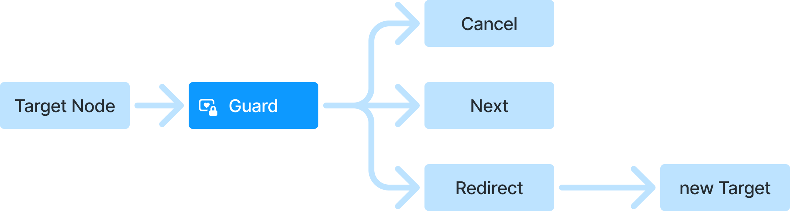

# Guards

`RouteNodeGuard` is a mechanism for controlling navigation state mutations.

## What is a Guard?

In [Quick start](quick_start.md), we introduced `RouteNode` as the navigation state tree. All
navigation operations (`push`, `pop`, and others) are implemented as mutations of that state.
Any mutation is a transition from an original state (`origin`) to a resulting state (`target`).

A **Guard** allows you to:

- continue navigation as-is (`next`)
- cancel navigation (`cancel`)
- replace the target with a different state (`redirect`)



In general, to implement a guard, use the following contract:

```dart
abstract interface class RouteNodeGuard {
  GuardResult call(
    RouteNode origin, // Source state
    RouteNode target, // Target state
    GuardContext context, // Navigation context
  );
}
```

As you can see, the guard return type is `GuardResult`.

## `GuardResult`

A guard can return one of the following outcomes:

```dart
// Continue navigation without changes
GuardResult.next()

// Redirect to a different target node
GuardResult.redirect(target: newTarget)

// Cancel navigation
GuardResult.cancel()
```

## Where to declare guards

You can declare `guards` in route declarations:

```dart
RouteDeclaration.routeBuilder(
  route: AppRoutes.someRoute,
  guards: const [
    AuthGuard(),
    TabInitGuard(tabRoute: AppRoutes.someTab, childRoute: AppRoutes.content),
  ],
  routeBuilder: /* ... */,
)
```

You can also declare them at the schema level:

```dart
base class RouterSchema implements Schema {
...

  @override
  @internal
  final Iterable<RouteNodeGuard> guards;
```

## Practical guard examples

Below are examples of common guard use cases.

### 1. Authorization check (`AuthGuard`)

Redirects to login if the user is not authorized:

```dart
class AuthGuard implements RouteNodeGuard {
  final AuthService authService;

  const AuthGuard(this.authService);

  @override
  GuardResult call(
    RouteNode origin,
    RouteNode target,
    GuardContext context,
  ) {
    if (isInLoginNode(target)) {
      return const GuardResult.next();
    }

    final isAuthorized = authService.isAuthorized();
    if (!isAuthorized) {
      // Save target route for post-login redirect
      return GuardResult.redirect(
        target: AppRoutes.login.toNode(
          extra: {'returnTo': target},
        ),
      );
    }

    return const GuardResult.next();
  }
}

final profileDeclaration = RouteDeclaration.routeBuilder(
  route: AppRoutes.profile,
  guards: [AuthGuard(authService)],
  routeBuilder: RouteBuilder.widget(/* ... */),
);
```

**Note:** In the current `yx_navigation` implementation, guards declared in a declaration context
are still applied to the mutation pipeline generally, not only to mutations of that exact route.
So this is currently more semantic than strictly route-scoped behavior.

For auth checks in particular, it is usually enough to declare such a guard once:

- either in one declaration entry
- or in the schema class itself

For example:

```dart
base class SomeRouterSchema extends RouterSchema {
  @override
  Iterable<RouteNodeGuard> get guards => [
    AuthGuard(authService),
  ];
}
```

### 2. Tab initialization (`TabInitGuard`)

Automatically inserts a child route if the tab node is empty:

```dart
/// Generic guard for tab initialization
class TabInitGuard implements RouteNodeGuard {
  final YxRoute tabRoute;
  final YxRoute childRoute;

  const TabInitGuard({
    required this.tabRoute,
    required this.childRoute,
  });

  @override
  GuardResult call(
    RouteNode origin,
    RouteNode target,
    GuardContext context,
  ) {
    // Create mutable target copy
    final mutableTarget = target.toMutable();

    // Find the tab node
    MutableRouteNode? tabNode = mutableTarget.findByRoute(tabRoute);

    // If the tab is empty, initialize it with a default child route
    if (tabNode != null && tabNode.children.isEmpty) {
      tabNode.setChildren([childRoute.toNode()]);
      return GuardResult.redirect(target: mutableTarget);
    }

    return const GuardResult.next();
  }
}

// Usage
final messagesTabDeclaration = RouteDeclaration.routeBuilder(
  route: AppRoutes.messagesTab,
  guards: const [
    TabInitGuard(
      tabRoute: AppRoutes.messagesTab,
      childRoute: AppRoutes.chatList,
    ),
  ],
  routeBuilder: RouteBuilder.outlet(/* ... */),
  declarations: [
    chatListDeclaration,
    chatDetailsDeclaration,
  ],
);
```

**Why this is useful:**

- prevents empty screens on first tab open
- initializes default content automatically
- simplifies `initialNodeBuilder` setup

### 3. Data validation (`DataValidationGuard`)

Checks that required data is present before opening the page:

```dart
class OrderDetailsGuard implements RouteNodeGuard {
  @override
  GuardResult call(
    RouteNode origin,
    RouteNode target,
    GuardContext context,
  ) {
    if (isInOrderListNode(target)) {
      return const GuardResult.next();
    }

    final orderId = target.arguments['orderId'];

    if (orderId == null) {
      // Redirect to orders list if ID is missing
      return GuardResult.redirect(
        target: AppRoutes.ordersList.toNode(),
      );
    }

    return const GuardResult.next();
  }
}

final orderDetailsDeclaration = RouteDeclaration.routeBuilder(
  route: AppRoutes.orderDetails,
  guards: const [OrderDetailsGuard()],
  routeBuilder: RouteBuilder.widget(
    builder: (context, node) => OrderDetailsPage(
      orderId: node.arguments['orderId'],
    ),
  ),
);
```

### 4. Permission check (`PermissionGuard`)

Checks user permissions for restricted functionality:

```dart
class PermissionGuard implements RouteNodeGuard {
  final Permission requiredPermission;
  final PermissionService permissionService;

  const PermissionGuard({
    required this.requiredPermission,
    required this.permissionService,
  });

  @override
  GuardResult call(
    RouteNode origin,
    RouteNode target,
    GuardContext context,
  ) {
    if (isAccessDeniedNode(target)) {
      return const GuardResult.next();
    }

    final hasPermission = permissionService.hasPermission(
      requiredPermission,
    );

    if (!hasPermission) {
      return GuardResult.redirect(
        target: AppRoutes.accessDenied.toNode(),
      );
    }

    return const GuardResult.next();
  }
}

// Usage
final adminPanelDeclaration = RouteDeclaration.routeBuilder(
  route: AppRoutes.adminPanel,
  guards: [
    PermissionGuard(
      requiredPermission: Permission.admin,
      permissionService: permissionService,
    ),
  ],
  routeBuilder: RouteBuilder.widget(/* ... */),
);
```

## Implementing Guards with `MutableRouteNode`

Guards receive immutable `RouteNode`, but can still modify the target through `toMutable()`:

```dart
@override
GuardResult call(
  RouteNode origin,
  RouteNode target,
  GuardContext context,
) {
  // 1. Create mutable copy
  final mutableTarget = target.toMutable();

  // 2. Find target node
  final tabNode = mutableTarget.findByRoute(AppRoutes.someTab);

  // 3. Modify node
  if (tabNode != null) {
    tabNode.setChildren([AppRoutes.defaultChild.toNode()]);
  }

  // 4. Return modified target
  return GuardResult.redirect(target: mutableTarget);
}
```

**Key `MutableRouteNode` methods:**

```dart
// Find node by route
MutableRouteNode? findByRoute(YxRoute route);

// Set children (replaces existing)
void setChildren(List<RouteNode> children);

// Add children
void addChildren(List<RouteNode> children);

// Remove children
void removeChildren(List<RouteNode> children);

// Set arguments
void setArguments(Map<String, dynamic> arguments);
```

## Execution order / Guard chain

**Important detail:** if several guards are declared, they run sequentially in the exact order they
are listed:

```dart
RouteDeclaration.routeBuilder(
  route: AppRoutes.protectedPage,
  guards: const [
    AuthGuard(), // 1. Authorization check
    PermissionGuard(), // 2. Permission check
    DataValidationGuard(), // 3. Data validation
  ],
  routeBuilder: /* ... */,
)
```

If any guard returns `GuardResult.cancel()`, all subsequent guards are skipped.
If a guard returns `GuardResult.redirect()`, the mutation result is replaced with the new target
node and guard checks are restarted against that new `target`.

## When to use guards

✅ **Use Guards when:**

- you need checks before navigation (auth, permissions)
- you need automatic state initialization (tabs, outlets)
- you need data validation before opening a page
- you need redirects when required data is missing
- you need navigation-level logging or analytics hooks

❌ **Avoid Guards when:**

- the issue can be solved in UI (for example, hiding a button)
- the logic belongs to business flows (prefer `RouteNodeStateManager` / `Interactor`)

## When to use Guards vs business logic

**Guards** are used to control navigation access:

```dart
class AuthGuard implements RouteNodeGuard {
  // Checks whether route transition is allowed
  @override
  GuardResult call(...) {
    if (!isAuthorized()) {
      return GuardResult.redirect(target: loginRoute);
    }
    return GuardResult.next();
  }
}
```

**Business logic** is used to orchestrate actions and then navigate:

```dart
class AuthInteractor {
  // Performs login and then navigates
  Future<void> login(String username, String password) async {
    await authService.login(username, password);
    navigationController.push(AppRoutes.home);
  }
}
```

## Example files

- [TabInitGuard](../packages/yx_navigation_flutter/example/lib/src/route_declarations/guards/tab_init_guard.dart)
- [driver_app_with_tabs_and_profile.dart](../packages/yx_navigation_flutter/example/lib/src/route_declarations/06_driver_app_with_tabs_and_profile.dart)
- [complex_driver_app.dart](../packages/yx_navigation_flutter/example/lib/src/route_declarations/08_complex_driver_app.dart)

## See also

- [Route declarations](route_declarations.md) - using guards in declarations
- [Quick start](quick_start.md) - end-to-end usage examples
- [Declaration examples](../packages/yx_navigation_flutter/example/lib/src/route_declarations/)
