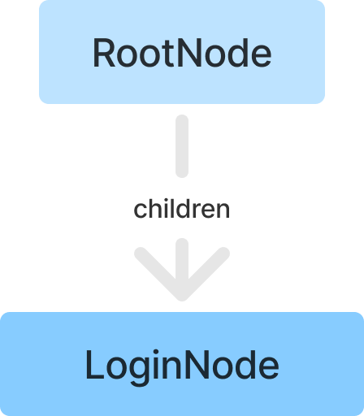
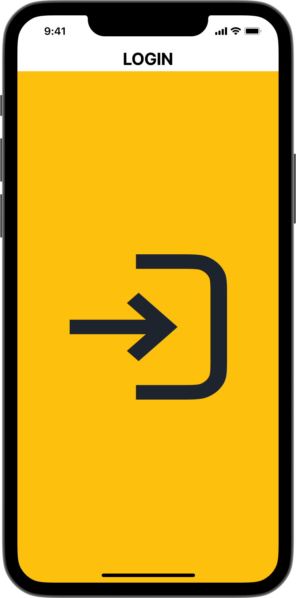
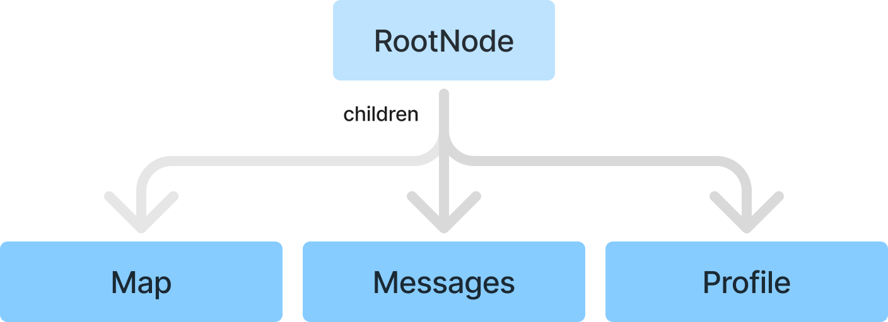
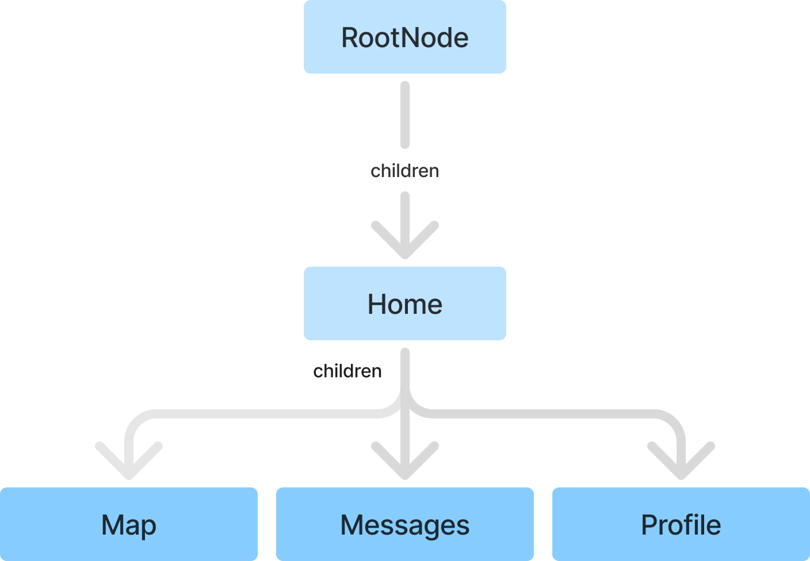
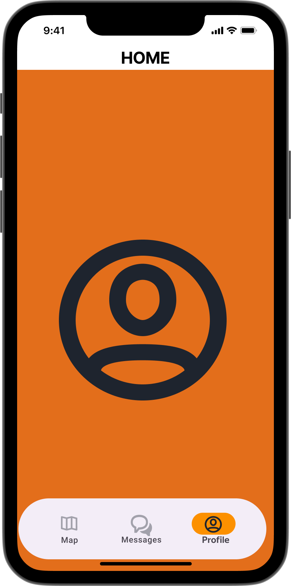
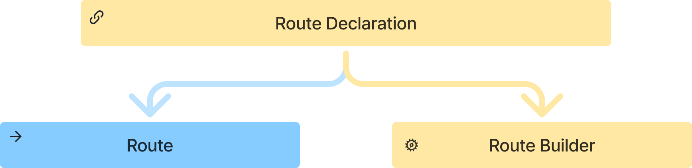
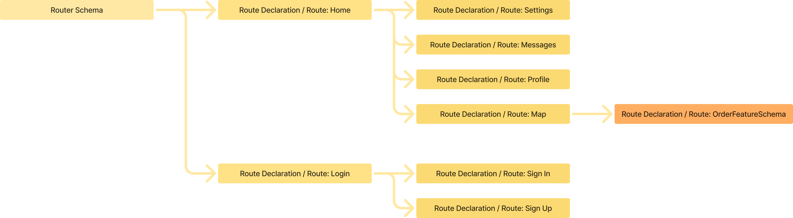

# Architecture - quick start

## Core principles

When designing the new navigation approach, we relied on the following key principles:

* Single source of truth represented by **State**
* Declarative setup that defines how feature navigation can look - that is, its **Schema**
* Isolation - a principle that allows changing only your own "slice" of state within shared
  navigation state (more on state below)
* Atomicity - a feature schema can be used standalone or nested inside a parent schema
* Ability to work with navigation state without coupling to Flutter or `BuildContext`
  (**Business Logic First** approach)

### State

Navigation state is a **tree structure** where each `RouteNode` can have child nodes (`children`)
of the same type.

Navigation state itself is also a single root node.

In this state tree, the `children` list can be interpreted in different ways:

* Navigation stack - child pages are built sequentially one over another
* Adjacent navigation stacks (nested navigation)
* Indexed stack - tab implementation where each tab `RouteNode` and its `children` can be treated
  as an isolated navigation stack

For example, consider the state where user is not authenticated.

In this case, the state tree has only one child node (`children: [Login]`):

   

This can be interpreted as rendering a single Login screen where the user enters credentials.

After authorization, user may transition to this state (`children: [Map, Messages, Profile]`):

This state can be interpreted as a screen stack (`navigator outlet`, or simply navigator), where
Profile is above Messages, and Messages is above Map.

     

Now let us look at another example (`children: [Home + children: [Map, Messages, Profile]]`).

      

This can be interpreted in two equivalent ways:

* as another page stack (`Map`, `Messages`, `Profile`) placed above `Home`
* or as an `IndexedStack` where `Map`, `Messages`, and `Profile` are stacked inside `Home`

This is how tab behavior is implemented, where each tab is represented by its own state node in the
parent `children` collection.

How navigation state (and a specific `RouteNode`) is transformed into actual UI state is defined by
`RouteDeclaration`. We will cover these entities in more detail in the schema configuration docs.

&nbsp;

Below is a short overview of API layers in the new navigation approach and its main entities.
More detailed docs will follow.

## **API layers in yx_navigation**

At the moment, the navigation system has two API layers:


> Legend:
>
> Blue - APIL1 entities
>
> Yellow - APIL2 entities

### **APIL1 (`yx_navigation` package) - first-level API**

This is the core package without Flutter SDK dependencies, designed for navigation state
management.

**Main components:**

* `RouteNodeStateManager` - manages global navigation state for a schema root; implements
  `NavigationController`.
* `BaseResolveStateManager` - manages navigation state within a branch of the tree: it wraps a
  parent `NavigationController` and a `RouteNodeResolver`, so every read/mutation goes through the
  resolver’s view of the subtree. You usually obtain it as `NavigationController` via
  `NavigationController.node(stateManager: ..., nodeResolver: ...)`.
* `NavigationController` - shared contract implemented by `RouteNodeStateManager` (root) and
  `BaseResolveStateManager` (resolved branch). Pairing with `RouteNodeResolver` is what scopes a
  controller to a nested branch.
* `RouteNode` - nodes of the navigation tree. Navigation state itself is the root (`root`) node
* `RouteNodeGuard` - defines state mutation rules. Using `RouteNodeGuard`, you can block (`cancel`)
  transition into an invalid target state, or define additional conditional state mutation rules
  (`redirect`). See [guards.md](guards.md).

* `YxRoute` - describes a specific route. At this level, `YxRoute` can be treated as route identity
  (which is generally true)

**Where these components are used:**

* In navigation business-logic interactors
* For programmatic navigation control
* In tests for verifying navigation logic

**Interactor usage example:**

```dart
class MyFeatureInteractor {
  final NavigationController _navigationController;

  void navigateToDetails(String itemId) {
    _navigationController.push(
      const YxRoute(id: 'details'),
      arguments: {'itemId': itemId},
    );
  }
}
```

&nbsp;

### **APIL2 (`yx_navigation_flutter` package) - second-level API**

At this layer, we work with navigation in Flutter context and with Flutter-specific entities
(`BuildContext`, `Page`, `Route`, `Navigator`, `Router`, and others).

This is where we describe UI (views) and how it should look based on APIL1 navigation state.

**Main components:**

* `RouteDeclaration` - declarative UI description for specific `YxRoute` routes.
  See [route_declarations.md](route_declarations.md).
* `RouteBuilder` - state-based UI builder for a given `YxRoute`.
  `RouteDeclaration` links `YxRoute` with UI builder



* `RouterSchema` - router schema for Flutter Router API. Visually, `RouterSchema` defines the tree
  of declarations, declaration hierarchy, declaration nesting, and nested feature schema reuse



* `NavigatorOutlet` - container widget for displaying navigation, rendering `children` collection as
  a screen stack
* `YxRouterConfig` - router configuration for Flutter Router API.
  This config bundles what `MaterialApp.router` expects: `YxRouterDelegate`
  (`RouterDelegate<RouteNode>`), optional `YxRouteInformationParser` /
  `YxRouteInformationProvider` (Flutter `RouteInformationParser` / `RouteInformationProvider`),
  and `BackButtonDispatcher`.

**These and other APIL2 components are used:**

* In UI layer for rendering navigation
* For integration with Flutter Router 2.0
* For declarative screen description
* In widgets for building interface

**UI usage example:**

```dart
class AppNavigationSchema extends RouterSchema {
  @override
  Iterable<RouteDeclaration> get declarations => [
        RouteDeclaration.routeBuilder(
          route: const YxRoute(id: 'home'),
          routeBuilder: RouteBuilder.widget(
            builder: (context, node) => HomeScreen(),
          ),
        ),
        RouteDeclaration.routeBuilder(
          route: const YxRoute(id: 'details'),
          routeBuilder: RouteBuilder.widget(
            builder: (context, node) => DetailsScreen(
              itemId: node.arguments['itemId'],
            ),
          ),
        ),
      ];

  @override
  RouteNode initialNodeBuilder(MutableRouteNode node) =>
      node..setChildren([
        const YxRoute(id: 'home').toNode(),
      ]);
}

class MyApp extends StatelessWidget {
  Widget build(BuildContext context) {
    return MaterialApp.router(
      routerConfig: AppNavigationSchema().build(),
    );
  }
}
```
