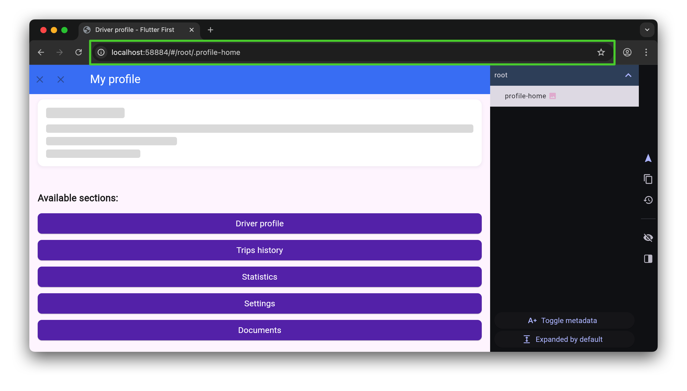
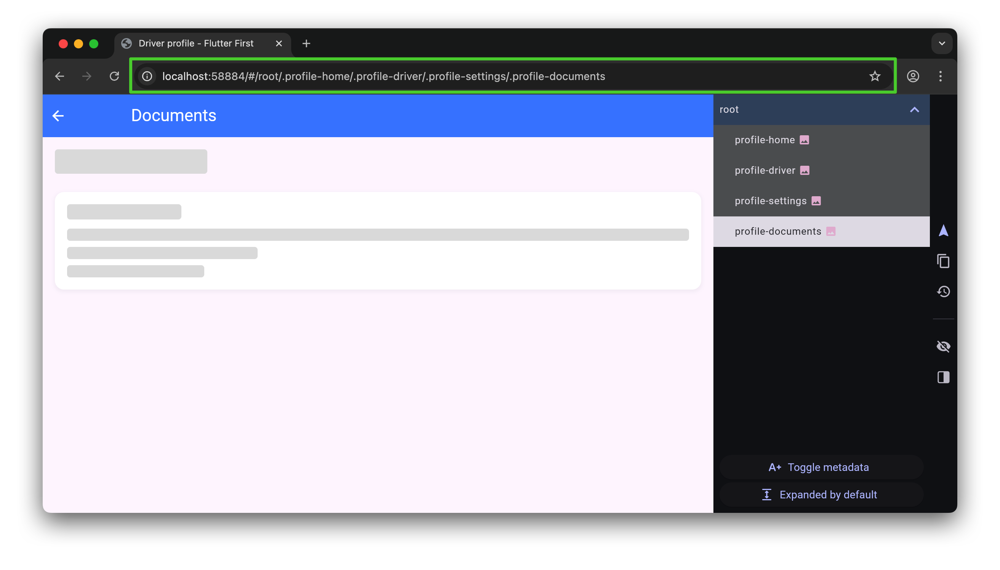
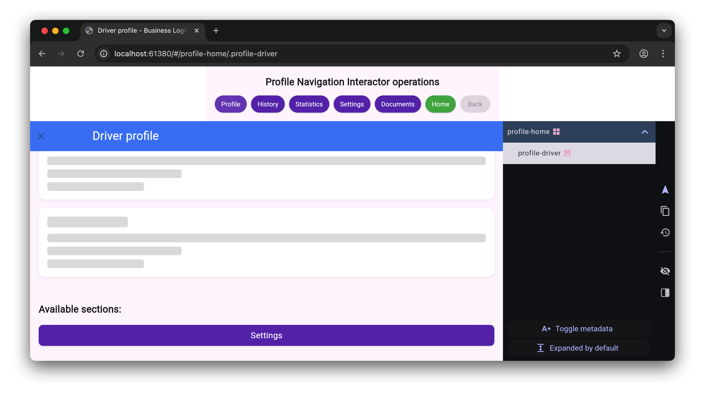
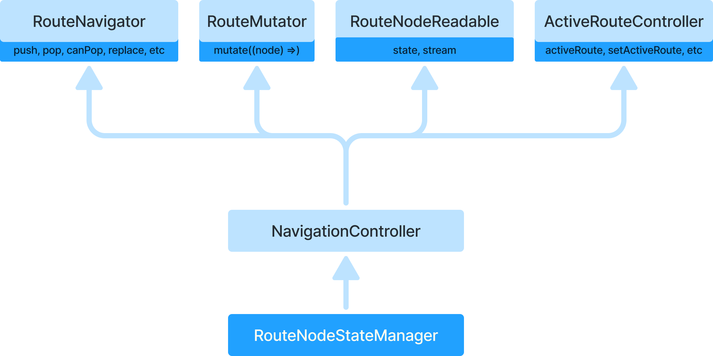
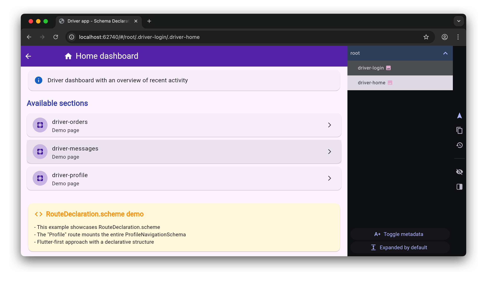
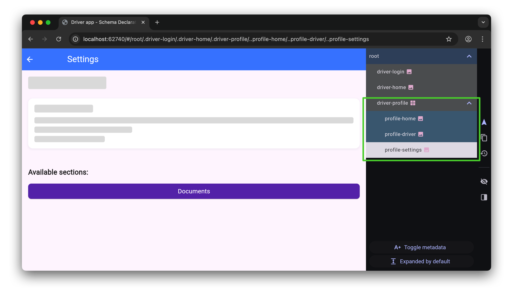
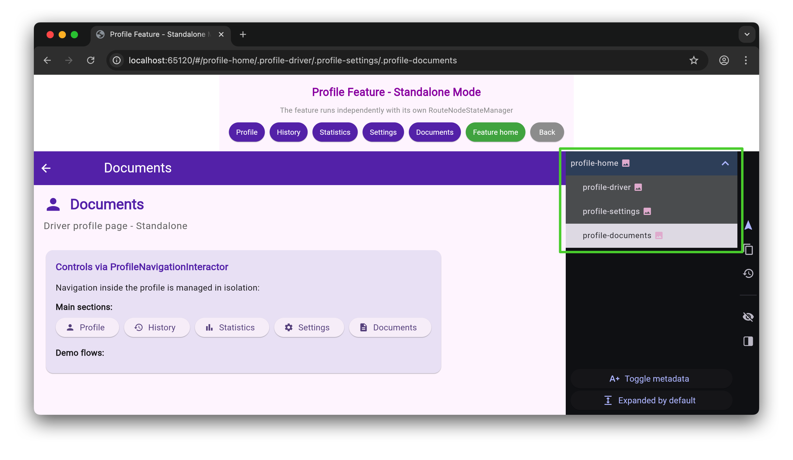
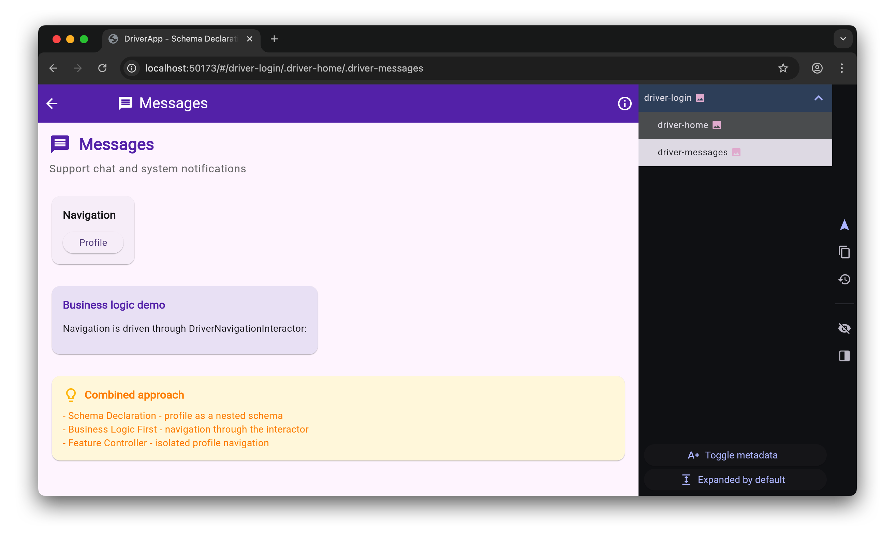
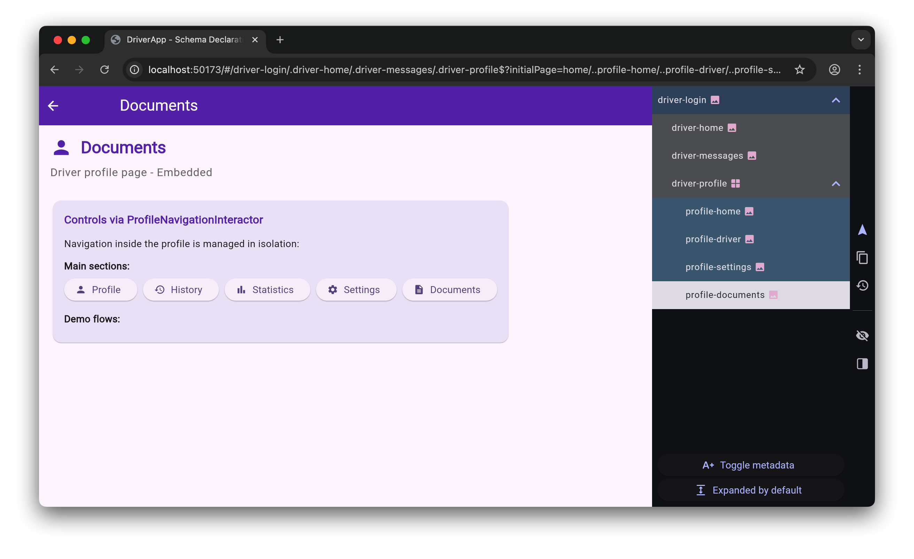

# Quick Start

YX Navigation is a new declarative navigation solution for Flutter applications, built on top of
the Navigator 2.0 API.

The solution is designed around a two-tier architecture that separates navigation business logic
from UI representation.

Before going further, we recommend reviewing the core concepts in
[Architecture - quick start](quick_architecture.md) ⌛️.
This will help you understand the key entities used by the new approach and how to reason about
tree-based navigation state.

But if you are in a hurry, you can start with this section directly.

## Driver profile feature overview

Our running example is the Driver Profile feature.
This is a standalone feature maintained by a dedicated team. Let us assume it contains these
sections:

* Driver profile - viewing and editing personal data
* Trip history - list of completed orders
* Statistics - analytics for earnings and rating
* Settings - app configuration
* Documents - upload and document management

In the simplest case, each section is represented by a separate app page. Let us build a
navigation schema for the Driver Profile feature.

## Driver profile - Flutter-First approach

Example is available here:
[packages/yx_navigation_flutter/example/lib/src/quick_start/01 - profile - flutter-first-scenario](../packages/yx_navigation_flutter/example/lib/src/quick_start/01%20-%20profile%20-%20flutter-first-scenario/)

The first step is to define the list of available routes.

```dart
/// Driver profile feature routes
abstract class ProfileRoutes {
  /// Profile home page - overview of driver information
  static const home = YxRoute(id: 'profile-home');

  /// Driver profile page - view and edit personal data
  static const driverProfile = YxRoute(id: 'profile-driver');

  /// Trip history page - list of completed orders
  static const tripsHistory = YxRoute(id: 'profile-trips-history');

  /// Statistics page - analytics for earnings and rating
  static const statistics = YxRoute(id: 'profile-statistics');

  /// Settings page - app configuration
  static const settings = YxRoute(id: 'profile-settings');

  /// Documents page - upload and document management
  static const documents = YxRoute(id: 'profile-documents');
}
```

Next, we map each route to the UI shown when that route is opened.
This route-to-UI mapping is defined through declarations using `RouteDeclaration`.
For example, navigating to `ProfileRoutes.driverProfile` renders `ProfileSkeletonPage`.

```dart
/// Driver profile page declaration
final driverProfileRouteDeclaration = RouteDeclaration.routeBuilder(
  route: ProfileRoutes.driverProfile,
  routeBuilder: RouteBuilder.widget(
    builder: (context, state) => const ProfileSkeletonPage(
      title: 'Driver profile',
      nextRoutes: [ProfileRoutes.settings],
    ),
  ),
);
```

For `ProfileRoutes.documents`, it looks like this:

```dart
final documentsRouteDeclaration = RouteDeclaration.routeBuilder(
  route: ProfileRoutes.documents,
  routeBuilder: RouteBuilder.widget(
    builder: (context, state) => const ProfileSkeletonPage(
      title: 'Documents',
    ),
  ),
);
```

The difference from the previous declaration is that for `ProfileRoutes.driverProfile` we passed
`nextRoutes: [ProfileRoutes.settings]`. This defines the list of routes and corresponding demo
buttons available for further navigation inside the Driver Profile feature.

For all other routes, `RouteDeclaration` can look roughly the same.
So now we have defined all declarations for `ProfileRoutes`, which describe the navigation schema of
our Driver Profile feature.

```dart
  @override
  List<RouteDeclaration> get declarations => [
        RouteDeclaration.routeBuilder(
          route: ProfileRoutes.home,
          routeBuilder: RouteBuilder.widget(
            builder: (context, state) => const ProfileSkeletonPage(
              title: 'Driver profile',
              nextRoutes: [
                ProfileRoutes.driverProfile,
                ProfileRoutes.tripsHistory,
                ProfileRoutes.statistics,
                ProfileRoutes.settings,
                ProfileRoutes.documents,
              ],
            ),
          ),
        ),
        driverProfileRouteDeclaration,
        tripsHistoryRouteDeclaration,
        statisticsRouteDeclaration,
        settingsRouteDeclaration,
        documentsRouteDeclaration,
      ];
```

Navigation schema is one of the key concepts.

A schema defines feature routing rules: nested declarations, guard list (we discuss guards later),
and initial state setup. It helps logically group declarations and guards for one feature and keep
it separated from others. Later, we will see how to use this schema as a nested schema inside a
parent navigation schema.

Schema definition also controls how navigation state for this feature is isolated from other
features. More on that below.

Let us define `ProfileNavigationSchema` for our feature:

```dart
base class ProfileNavigationSchema extends RouterSchema {
  @override
  RouteNode initialNodeBuilder(MutableRouteNode node) => node
    ..setChildren(
      [
        ProfileRoutes.home.toNode(),
      ],
    );

  @override
  List<RouteDeclaration> get declarations => [
        RouteDeclaration.routeBuilder(
          route: ProfileRoutes.home,
          routeBuilder: RouteBuilder.widget(
            builder: (context, state) => const ProfileSkeletonPage(
              title: 'Driver profile',
              nextRoutes: [
                ProfileRoutes.driverProfile,
                ProfileRoutes.tripsHistory,
                ProfileRoutes.statistics,
                ProfileRoutes.settings,
                ProfileRoutes.documents,
              ],
            ),
          ),
        ),
        driverProfileRouteDeclaration,
        tripsHistoryRouteDeclaration,
        statisticsRouteDeclaration,
        settingsRouteDeclaration,
        documentsRouteDeclaration,
      ];
}
```

`ProfileNavigationSchema` extends `RouterSchema`, which lets us define child declarations via
`List<RouteDeclaration> get declarations`. It also lets us define initial navigation state via
`initialNodeBuilder`.

`initialNodeBuilder` is a callback that receives the root node of navigation state (which is a
tree), and allows you to define its children, grandchildren, and deeper levels. By defining the
initial schema state, you define how this feature looks at startup.

For example, this setup creates a single initial screen:

```dart
node
..setChildren(
    [
    ProfileRoutes.home.toNode(),
    ],
)
```

Result:



Notice the address bar state - it currently contains a serialized representation of navigation
state. Also, for analyzing current navigation state, the debug panel is convenient (shown pinned on
the right).

> A quick way to enable the debug panel is passing
> `DebugPanelModeNotifier(enableDebugPanel: true)` to `RouterSchema.build()`.

And this version shows a startup stack of multiple pages, one after another:

```dart
node
..setChildren(
    [
    ProfileRoutes.home.toNode(),
    ProfileRoutes.driverProfile.toNode(),
    ProfileRoutes.tripsHistory.toNode(),
    ProfileRoutes.statistics.toNode(),
    ProfileRoutes.settings.toNode(),
    ProfileRoutes.documents.toNode(),
    ],
)
```

Result:



Now we know how to define initial state and the declaration list that makes up feature navigation
schema.

So we defined initial feature state and declarations. How do we launch the app?

The simplest way is the Flutter-First approach: we build a `RouterConfig` for the feature and pass
it to `MaterialApp.router`.

```dart
class _ProfileAppState extends State<ProfileApp> {
  late YxRouterConfig config;

  @override
  void initState() {
    super.initState();

    // Create navigation schema and build router config
    final profileSchema = ProfileNavigationSchema();
    config = profileSchema.build();
  }

  @override
  Widget build(BuildContext context) => MaterialApp.router(
        title: 'Driver profile',
        theme: ThemeData(
          colorScheme: ColorScheme.fromSeed(
            seedColor: Colors.blueAccent,
          ),
          useMaterial3: true,
          appBarTheme: const AppBarTheme(
            centerTitle: false,
            backgroundColor: Colors.blueAccent,
            foregroundColor: Colors.white,
          ),
        ),
        debugShowCheckedModeBanner: false,
        routerConfig: config,
      );

  @override
  void dispose() {
    config.dispose();
    super.dispose();
  }
}
```

In the code above, we call `build()` and get `YxRouterConfig`, then pass it to
`MaterialApp`. This `YxRouterConfig` already contains all required Router components (Navigator 2.0):

* `YxRouterDelegate` (`RouterDelegate<RouteNode>`)
* `YxRouteInformationParser` (`RouteInformationParser<RouteNode>`), when enabled
* `YxRouteInformationProvider` (`RouteInformationProvider`), when enabled
* `BackButtonDispatcher`

Now let us use navigation operations for opening a specific screen. We will use familiar Navigator
1.0-style methods like `push` and `pop`.
But we use them through `RouteNavigator`, not Navigator 1.0 directly.

Let us inspect `build` in `ProfileSkeletonPage`:

```dart
  @override
  Widget build(BuildContext context) {
    // Get navigator for page transitions
    final routeNavigator = YxNavigation.navigatorOf(context);
    final canPop = routeNavigator.canPop();

    return Scaffold(
      appBar: AppBar(
        ...
        leading: SizedBox(
          child: Row(
            children: [
              IconButton(
                tooltip: 'Back',
                icon: canPop
                    ? const Icon(Icons.arrow_back)
                    : const Icon(Icons.close),
                onPressed: canPop ? routeNavigator.pop : null,
              ),
            ],
          ),
        ),
      ),
      ...
    );
  }
```

We obtain `routeNavigator` from context using the familiar `.of()` pattern:
`YxNavigation.navigatorOf(context)`.

Once you have `RouteNavigator`, you can check whether current page can be closed (`pop`) and
navigate to routes declared in `ProfileNavigationSchema`.

Operations provided by `RouteNavigator` are also called **primitives**, because they provide a
minimal operation set, broadly matching both standard Flutter API and semantics used in other
packages (`go_router`, `auto_route`, etc. also expose `push`, `pop`, and similar primitives).

To navigate, call `push`, for example:

```dart
routeNavigator.push(ProfileRoutes.driverProfile);
```

Important detail: all `RouteNavigator` operations are asynchronous by design.

Why? We will cover this when discussing `RouteMutator`.

Another important point: every navigator operation (`push`, `pop`, and others) triggers a state
mutation. State mutations can add or remove `RouteNode` entries in the global state tree, but this
is not guaranteed. Why? Because `RouteNodeGuard` may alter behavior. You already saw some details of
the guard mechanism in [Architecture - quick start](quick_architecture.md). Full details are covered
in the dedicated guards section.

Let us close this section with the core summary:

* To define a route, you need `YxRoute`
* To map a page widget to a route, you need `RouteDeclaration`
* To assemble everything, you need a schema (`RouterSchema`)
* You get `RouterConfig` by calling `build()` on `RouterSchema`
* For navigation (`push`) and closing current screen (`pop`) you need `RouteNavigator`, available via
  `YxNavigation.navigatorOf(context)`

## Driver profile - Business-Logic-First approach

Example is available here:
[packages/yx_navigation_flutter/example/lib/src/quick_start/02 - profile - business-logic-first-scenario](../packages/yx_navigation_flutter/example/lib/src/quick_start/02%20-%20profile%20-%20business-logic-first-scenario/)

In the previous example, we got `RouteNavigator` from Flutter context after creating `RouterConfig`
and passing it into `MaterialApp.router()`.

Using `RouteNavigator`, we called `push` for navigation.
Under the hood, `push` did the following:

* Created a new node in navigation tree state
* Took the current navigation state represented by `RouteNode`
* Added a new node to the current node's children collection

After state mutation, `yx_navigation` reactively rebuilt the page list and updated UI.
With `RouteNavigator`, you do not manipulate navigation state directly - you use familiar Navigator
1.0-like operations.

But if you want full control over navigation state handling, use `RouteNodeStateManager`.
Let us look at the scenario where navigation state is controlled from business logic, without
dependency on Flutter entities (such as `BuildContext`).

Same feature example - Driver Profile. But now we add `ProfileNavigationInteractor`, which owns all
screen opening operations:

```dart
class ProfileNavigationInteractor {
  late final RouteNodeStateManager _stateManager;

  /// Expose state manager for UI layer
  RouteNodeStateManager get stateManager => _stateManager;

  /// Navigator for business-logic calls
  RouteNavigator get navigator => _stateManager;

  ProfileNavigationInteractor() {
    _stateManager = RouteNodeStateManager(
      routeNode: ProfileRoutes.home.toNode(),
    );
  }

  // ============================================================================
  // Navigation methods - callable from business logic
  // ============================================================================

  /// Open driver profile page
  void openDriverProfile() => navigator.push(ProfileRoutes.driverProfile);

...
```

`ProfileNavigationInteractor` creates `RouteNodeStateManager`, which contains all state mutation
operations. `RouteNodeStateManager` also implements another critical contract - `RouteMutator`,
which defines low-level navigation state mutation:

```dart
abstract class RouteMutator {
  RouteNode mutate(MutateNodeCallback callback);
}

typedef MutateNodeCallback = RouteNode Function(
  MutableRouteNode routeNode,
);
```

In general, with `RouteNodeStateManager` you can call `mutate` for arbitrary state changes.
But in most regular scenarios that is not needed, and you will mostly use primitive operations like
`push`, `pop`, and others.

If you inspect these methods (`push`, `pop`), you can see they are all implemented via `mutate`:

```dart
  @override
  void push(
    YxRoute route, {
    Map<String, String>? arguments,
    Map<String, Object?>? extra,
  }) =>
      mutate(
        (routeNode) {
          final value = RouteNode.fromRoute(
            route: route,
            arguments: arguments ?? const {},
            extra: extra ?? const {},
          );

          routeNode.add(value);
          return routeNode;
        },
      );
```

So now we have `ProfileNavigationInteractor`, which creates a dedicated `RouteNodeStateManager` for
state handling. Next, while building `RouterConfig`, we explicitly pass the state manager we want:

```dart
class _ProfileAppState extends State<ProfileApp> {
  late YxRouterConfig config;

  @override
  void initState() {
    super.initState();

    // In business-logic-first, we get ready stateManager
    // from Dependencies, with required initial state already set
    final stateManager =
        DependenciesScope.of(context, listen: false).stateManager;

    // Create navigation schema and pass prepared stateManager
    final profileSchema = ProfileNavigationSchema();
    config = profileSchema.build(
      stateManagerConfiguration: StateManagerConfiguration(
        stateManager: stateManager,
      ),
      ...
    );
```

In this example (available at
[packages/yx_navigation_flutter/example/lib/src/quick_start/02 - profile - business-logic-first-scenario](../packages/yx_navigation_flutter/example/lib/src/quick_start/02%20-%20profile%20-%20business-logic-first-scenario/))
we get `RouteNodeStateManager` as a DI dependency. This allows `RouteNodeStateManager` usage
independently from Flutter UI, directly in business logic.

Result (state operations are available both via context and via `NavigationInteractor`):



Section summary:

* Flutter-first approach:
  * `RouterSchema` is created in widget lifecycle
  * `RouterConfig` is built via `schema.build()`
  * `RouteNavigator` is available only after MaterialApp creation via `YxNavigation.navigatorOf(context)`
* Business-logic-first approach:
  * `RouteNodeStateManager` is created earlier in `ProfileNavigationInteractor`
  * `RouteNavigator` is available through state manager **before** `MaterialApp` creation
  * Business logic can control navigation independently from UI

## A bit more on `RouteNodeStateManager`

`RouteNodeStateManager` implements a very important contract: `NavigationController`.
Let us review it:

```dart
abstract class NavigationController
    implements
        RouteNodeReadable,
        RouteMutator,
        RouteNavigator,
        ActiveRouteController,
        Closable {
```

`NavigationController` combines the following contracts:

* `RouteNavigator` - primitive operations such as `push`/`pop` and others.
* `RouteMutator` - low-level state mutation; contains one async `mutate` operation. State mutation
  mechanics are similar to `yx_state` with sequential concurrency.
* `ActiveRouteController` - defines which route is currently active and provides read/subscribe APIs.
  This becomes useful for tabbed navigation or `IndexedStack` scenarios. We skip deep details for now.
* `RouteNodeReadable` - allows reading current state and subscribing to state updates.

```dart
/// Interface exposing data-reading methods for RouteNode state.
abstract interface class RouteNodeReadable {
  /// Stream getter returns RouteNode updates.
  Stream<RouteNode?> get stream;

  /// State getter returns current RouteNode state.
  RouteNode? get state;
}
```



Any of these contracts is available through Flutter context:

```dart
    final RouteNavigator routeNavigator = YxNavigation.navigatorOf(context);
    final RouteMutator routeMutator = YxNavigation.mutatorOf(context);
    final NavigationController navigationController = YxNavigation.navigationControllerOf(context)!;
```

In the example above, you may have noticed that creating `RouteNodeStateManager` requires `routeNode`:

```dart
    _stateManager = RouteNodeStateManager(
      routeNode: ProfileRoutes.home.toNode(),
    );
```

This value is the root node of your navigation state tree. With `RouteNodeStateManager`, you can
mutate the entire state including the root node itself.

## Integrating an external feature

Example is available here:
[packages/yx_navigation_flutter/example/lib/src/quick_start/03 - schema declaration usage scenario](../packages/yx_navigation_flutter/example/lib/src/quick_start/03%20-%20schema%20declaration%20usage%20scenario/)

In previous sections, we built a fully functional navigation schema for Driver Profile.

Now imagine another scenario: there is a separate team building a main Driver App with their own
routes (Login, Home, Orders, Messages), and they want to plug in the ready-made Profile feature as
one of app pages.

This approach is common in larger projects:

* Team A builds Profile feature with its own navigation
* Team B builds the main app and wants to embed Profile
* Team C may want to reuse the same Profile feature in another app

### Solution via `RouteDeclaration.scheme` (`RouteSchemaDeclaration`)

yx_navigation provides a straightforward solution: connect ready navigation schemas via
`RouteSchemaDeclaration`. Instead of creating isolated widgets, you connect an entire navigation
schema as a nested module.

Let us build a Driver App that reuses the prepared `ProfileNavigationSchema`.

Define main app routes:

```dart
/// Driver app routes
abstract class DriverRoutes {
  /// Login page
  static const login = YxRoute(id: 'driver-login');

  /// Home page - driver dashboard
  static const home = YxRoute(id: 'driver-home');

  /// Orders page - active and available orders
  static const orders = YxRoute(id: 'driver-orders');

  /// Messages page - support chat and notifications
  static const messages = YxRoute(id: 'driver-messages');

  /// Profile page - driver profile (nested schema)
  static const profile = YxRoute(id: 'driver-profile');
}
```

Notice the `driver-` prefix in route IDs - it helps avoid conflicts across schemas (known limitation,
planned for improvement).

Now import the ready profile schema and connect it:

```dart
// Import prepared profile schema from another feature
import '../01 - profile - flutter-first-scenario/profile_navigation_schema.dart';

/// ⭐ KEY FEATURE: external schema connection
final profileSchemaDeclaration = RouteDeclaration.scheme(
  route: DriverRoutes.profile,
  schema: ProfileNavigationSchema(),
);
```

Create main Driver App navigation schema:

```dart
base class DriverNavigationSchema extends RouterSchema {
  ...

  @override
  List<RouteDeclaration> get declarations => [
    // Main app routes
    loginRouteDeclaration,
    homeRouteDeclaration,
    ordersRouteDeclaration,
    messagesRouteDeclaration,

    // ⭐ EXTERNAL SCHEMA INTEGRATION
    // Instead of RouteDeclaration.routeBuilder, we use
    // RouteDeclaration.scheme to connect an entire schema
    profileSchemaDeclaration,
  ];
}
```

After this integration, navigation structure looks like:

```text
Driver App
  Login
  Home
  Orders
  Messages
  Profile (NESTED ProfileNavigationSchema)
    Profile Home 🏠
    Driver Profile
    Trips History
    Statistics
    Settings
    Documents
```

Run the example. You enter DriverApp and see two loaded root pages, each represented by its own
nodes in the shared state tree.



When navigating to `DriverRoutes.profile`, you enter isolated Profile navigation with all its pages
and transition logic.



Using debug panel, you can see nested feature state rendered as a nested branch starting from
`driver-profile`. Any feature connected this way through `RouteSchemaDeclaration` uses a nested
navigator for its own routes.

### Benefits of this approach

**Modularity**: Each feature has an isolated navigation schema that can be developed and tested
independently.
In our case, Profile from the first example remains isolated.

**Reusability**: The same schema can be reused across different apps. `ProfileNavigationSchema` can
be connected to Driver App, courier app, admin app, or used as root schema in its own app.

**Encapsulation**: All complex profile navigation logic remains hidden inside
`ProfileNavigationSchema`. The main app does not need to know profile internals.

**Scalability**: New features are easy to add. Want "Ratings"? Create `RatingsNavigationSchema` and
connect it via `RouteDeclaration.scheme`.

**Independent development**: Different teams can build features independently and integrate them
later into main app.

### Declaration comparison

So far, we used two declaration types:

| Approach                        | Usage                                              |
| ------------------------------ | -------------------------------------------------- |
| `RouteDeclaration.routeBuilder` | For individual pages and simple transitions       |
| `RouteDeclaration.scheme`       | For connecting ready navigation schemas as modules |

There are more declaration types; we will cover them later.

```dart
// Regular declaration for a single page
RouteDeclaration.routeBuilder(
  route: DriverRoutes.orders,
  routeBuilder: RouteBuilder.widget(
    builder: (context, state) => OrdersPage(),
  ),
)

// Schema declaration for connecting a full module
RouteDeclaration.scheme(
  route: DriverRoutes.profile,
  schema: ProfileNavigationSchema(), // Entire feature
)
```

Section summary:

* Use `RouteDeclaration.scheme` to connect ready navigation schemas
* External schemas are imported as regular Dart modules
* Connected schema works as full nested navigation
* This approach provides modularity and code reuse across teams

## Combined approach: Schema Declaration + Business Logic First

Example is available here:
[packages/yx_navigation_flutter/example/lib/src/quick_start/04 - schema declaration and business logic first scenario](../packages/yx_navigation_flutter/example/lib/src/quick_start/04%20-%20schema%20declaration%20and%20business%20logic%20first%20scenario/)

In previous examples, we covered three approaches:

* **Flutter-First** - schema is created in UI, navigation through context
* **Business-Logic-First** - all control in interactors, independent from UI
* **Schema Declaration** - connect ready schemas as modules

But what if we want to **combine advantages of all approaches**?

Consider this scenario:

* **Main app** requires business-logic-first navigation control
* **Nested features** are connected through schema declaration as isolated modules
* Full feature isolation must be preserved - no direct module-to-module dependencies
* Different app parts are controlled by different controllers, while sharing one navigation state

This is exactly what the combined approach with `NavigationController.node` solves.

### Architectural problem

In large apps, one feature is often embedded into another or into a parent app:

```text
Driver App (main app)
  Login, Home, Orders, Messages  ← DriverNavigationInteractor
  Profile (isolated feature)     ← ProfileNavigationInteractor
    Profile Home
    Driver Profile
    Trips History
    Settings
```

The **problem** is how to ensure:

1. `DriverNavigationInteractor` controls main Driver App navigation
2. Profile feature is **fully isolated** and does not know main app exists
3. Main app has **no direct dependencies** on internal feature classes
4. Everything works over one shared navigation state
5. Profile remains reusable for any other app
6. And can still run standalone, for example in the demo app

### Solution - isolation via `NavigationController.node()`

Let us build a scenario that enforces these constraints:

* Direct calls to feature interactors from main app are forbidden
* Importing feature internal dependencies (`ProfileFeatureDependencies`) is forbidden
* Main app knows nothing about feature internal architecture
* Any direct links between business logic of different features are disallowed
* Nested feature cannot affect main app navigation state outside its own branch

Example path:
`packages/yx_navigation_flutter/example/lib/src/quick_start/04 - schema declaration and business logic first scenario`

Let us implement this scenario.

#### 1. Isolated dependencies of the main app

```dart
final class DriverAppDependencies {
  final RouteNodeStateManager stateManager;
  final DriverNavigationInteractor driverInteractor;

  // ✅ Only a NavigationController for the profile feature
  final NavigationController profileNavigationController;

  factory DriverAppDependencies() {
    // Create root RouteNodeStateManager
    final stateManager = RouteNodeStateManager(
      routeNode: DriverRoutes.login.toNode(),
    );

    // Create restricted controller for Profile branch DriverRoutes.profile
    final profileNavigationController = NavigationController.node(
      stateManager: stateManager,
      nodeResolver: RouteNodeResolver.id(route: DriverRoutes.profile),
    );

    // Create main app interactor WITHOUT feature dependencies
    final driverInteractor = DriverNavigationInteractor(
      stateManager: stateManager,
    );

    return DriverAppDependencies._(
      stateManager: stateManager,
      driverInteractor: driverInteractor,
      profileNavigationController: profileNavigationController,
    );
  }
}
```

#### 2. Isolated main app interactor

```dart
class DriverNavigationInteractor {
  final RouteNodeStateManager _stateManager;

  RouteNavigator get navigator => _stateManager;

  DriverNavigationInteractor({
    required RouteNodeStateManager stateManager,
  }) : _stateManager = stateManager;

  // Main navigation methods
  void openHome() => navigator.push(DriverRoutes.home);
  void openOrders() => navigator.push(DriverRoutes.orders);

  // ✅ Isolated profile navigation with argument transfer
  // to specify desired nested feature entry state
  void openProfile({String? initialPage}) {
    navigator.push(
      DriverRoutes.profile,
      arguments: initialPage != null ? {'initialPage': initialPage} : null,
    );
  }

  // Demonstrates different profile-opening scenarios
  void demonstrateProfileNavigation() {
    // Opens profile home page
    openProfile();

    // Opens directly on driver profile page
    openProfile(initialPage: 'driverProfile');
  }
}
```

#### 3. Profile schema with external initialization

```dart
base class ProfileNavigationSchema extends RouterSchema {
  @override
  RouteNode initialNodeBuilder(MutableRouteNode node) {
    // ✅ Read arguments to define initial state
    // (passed by openProfile({String? initialPage}))
    final initialPage = node.arguments['initialPage'] as String?;
    final initialRoute = _getInitialRoute(initialPage ?? 'home');

    return node..setChildren(_buildInitialNodes(initialPage ?? 'home', initialRoute));
  }

  // Resolve initial route from passed argument
  static YxRoute _getInitialRoute(String initialPage) {
    switch (initialPage) {
      case 'driverProfile':
        return ProfileRoutes.driverProfile;
      case 'settings':
        return ProfileRoutes.settings;
      case 'home':
      default:
        return ProfileRoutes.home;
    }
  }

  // Build nodes for initial state
  static List<RouteNode> _buildInitialNodes(String initialPage, YxRoute initialRoute) {
    final nodes = <RouteNode>[ProfileRoutes.home.toNode()];

    // If starting from a non-home page, add it to stack
    if (initialPage != 'home') {
      nodes.add(initialRoute.toNode());
    }

    return nodes;
  }

  @override
  List<RouteDeclaration> get declarations => [
    // ... other declarations
  ];
}
```

#### 4. Public profile feature scope that supports two modes - standalone and embedded

```dart
class ProfileFeatureDependenciesScope extends InheritedWidget {
  final ProfileFeatureDependencies dependencies;

  // Private constructor
  const ProfileFeatureDependenciesScope._({
    required this.dependencies,
    required super.child,
    super.key,
  });

  // ✅ Standalone mode
  ProfileFeatureDependenciesScope.standalone({
    required Widget child,
    Key? key,
  }) : this._(
          dependencies: ProfileFeatureDependencies.standalone(),
          child: child,
          key: key,
        );

  // ✅ Embedded mode
  ProfileFeatureDependenciesScope.embedded({
    required NavigationController navigationController,
    required Widget child,
    Key? key,
  }) : this._(
          dependencies: ProfileFeatureDependencies.embedded(
            navigationController: navigationController,
          ),
          child: child,
          key: key,
        );

  static ProfileFeatureDependencies of(BuildContext context) {
    final scope = context.dependOnInheritedWidgetOfExactType<ProfileFeatureDependenciesScope>();
    return scope!.dependencies;
  }
}
```

**Key point**: Main app **never imports** `ProfileFeatureDependencies`.
All dependency creation happens **inside standalone/embedded factories**, which guarantees strict
encapsulation.

#### 5. Build schema with a single integration point into Profile feature

```dart
base class DriverNavigationSchema extends RouterSchema {
  @override
  List<RouteDeclaration> get declarations => [
    // Main app routes
    loginRouteDeclaration,
    homeRouteDeclaration,
    ordersRouteDeclaration,
    messagesRouteDeclaration,

    // ✅ SINGLE integration point with Profile feature
    profileSchemaDeclaration,
  ];
}

// Feature schema declaration, where its scope is initialized
final profileSchemaDeclaration = RouteDeclaration.scheme(
  route: DriverRoutes.profile,
  schema: ProfileNavigationSchema(),
  outletBuilder: (context, state, outlet) {
    // ✅ Read NavigationController from main app
    final appDependencies = DriverAppDependenciesScope.of(context);

    // ✅ Create isolated feature inside dependency scope
    return ProfileFeatureDependenciesScope.embedded(
      navigationController: appDependencies.profileNavigationController,
      child: outlet,
    );
  },
);
```

#### 6. Initialize parent scope in UI

```dart
class _DriverAppState extends State<DriverApp> {
  @override
  void initState() {
    super.initState();

    // Get isolated main app dependencies
    final dependencies = DriverAppDependenciesScope.of(context, listen: false);
    final stateManager = dependencies.stateManager;

    // Create schema and pass prepared stateManager
    final driverSchema = DriverNavigationSchema();
    config = driverSchema.build(
      stateManagerConfiguration: StateManagerConfiguration(
        stateManager: stateManager,
      ),
    );
  }
}
```

#### Run results in both modes - standalone and embedded





Notice `driver-profile` lives one level deeper, in a dedicated `NavigationController`.



### Characteristics of this solution

### **Full feature isolation**

```dart
// ✅ Main app does NOT know feature internal architecture
driverInteractor.openProfile(initialPage: 'driverProfile');

// ❌ NO direct calls to feature interactors
// profileInteractor.openDriverProfile(); // FORBIDDEN
```

#### **Feature scope initialization via factories**

* Feature builds its own dependencies through dedicated factories. In standalone mode it creates a
  separate `RouteNodeStateManager`; in embedded mode it receives `NavigationController`. In both
  cases, feature navigation operates through `NavigationController`.
* Main app passes only the public `NavigationController` that "watches" its branch of shared
  navigation state.

#### **Argument-driven navigation**

```dart
// Configure initial feature state via arguments
navigator.push(
  DriverRoutes.profile,
  arguments: {'initialPage': 'driverProfile'},
);

// Feature decides how to interpret arguments
ProfileNavigationSchema() // reads arguments['initialPage']
```

#### **Maximum reusability**

* Same feature works in standalone and embedded modes
* No dependencies on main app
* Can be connected to any other app without changes

#### **Business Logic First everywhere**

```dart
void main() {
  final dependencies = DriverAppDependencies();

  // Can call navigation BEFORE UI creation!
  dependencies.driverInteractor.demonstrateProfileNavigation();

  runApp(DriverAppDependenciesScope(
    dependencies: dependencies,
    child: DriverApp(),
  ));
}
```

#### **Single navigation state**

All controllers work with one `RouteNodeStateManager`, but in isolated scopes:

* `DriverNavigationInteractor` → controls root state
* `ProfileNavigationInteractor` → controls only profile subtree
* State consistency and debugging are visible through debug panel

## Compare the presented yx_navigation approaches

| Approach                         | Feature isolation | Reusability         | Business Logic First | Best fit for                            |
| ------------------------------- | ----------------- | ------------------- | -------------------- | --------------------------------------- |
| **Flutter First**               | ❌ No             | ❌ Limited          | ❌ No                | Simple applications                     |
| **Business Logic First**        | ❌ No             | ❌ Limited          | ✅ Yes               | Complex business logic                  |
| **Schema Declaration**          | ⚠️ Partial        | ✅ Good             | ❌ No                | Modular applications                    |
| **Combined + Isolation**        | ✅ **Full**       | ✅ **Maximum**      | ✅ **Everywhere**    | **Large isolated applications**         |

### When to use the isolated approach

✅ **Ideal for:**

* **Large applications** with many isolated features
* **Distributed teams** working on different modules
* **Microfrontend-style architecture** on the client side
* **Feature reuse** across multiple applications
* **Complex navigation business logic**

❌ **Overkill for:**

* Simple apps with linear navigation
* Projects with a single team
* Prototypes and MVPs without scaling plans

### Final takeaways

**Combined approach with isolation provides:**

* ✅ **Full feature isolation** - no direct dependencies between modules
* ✅ **Maximum reusability** - features work across different applications
* ✅ **Business Logic First everywhere** - navigation controlled from business logic
* ✅ **Single navigation state** - consistency and debug visibility
* ✅ **Scalability** - easy to add new isolated features

Example path:
`packages/yx_navigation_flutter/example/lib/src/quick_start/04 - schema declaration and business logic first scenario`
