# Declaration types in yx_navigation

## Introduction

In [Quick start](quick_start.md), we described the Driver Profile feature UI using a schema and
declarations defined by `RouteDeclaration`.

**Declarations** in yx_navigation define how routes (`YxRoute`) are turned into UI using a given
`RouteBuilder`.

They are a core part of declarative navigation, linking navigation state to what the user sees.

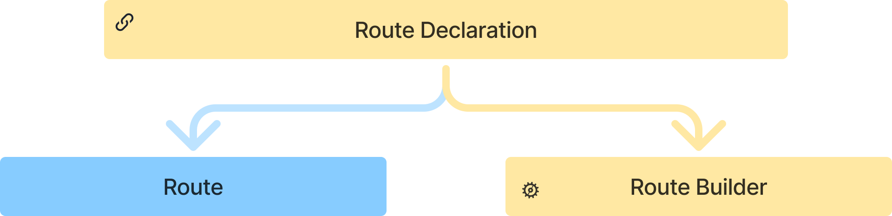

Below we walk through the declaration types supported in yx_navigation.

### Declaration types

Different declaration types solve different architectural problems. The following are supported:

- **RouteBuilderDeclaration** - general-purpose declaration for any scenario.

  - Works with `RouteBuilder`, where you can plug in any UI builder you need.

- **RouteSchemaDeclaration** - for wiring in isolated features.
  For more on feature isolation, see
  [Solution - isolation via `NavigationController.node()`](quick_start.md#solution---isolation-via-navigationcontrollernode)
  in Quick start.
  Importantly, with `RouteSchemaDeclaration` a nested feature can only operate on its own slice of
  the shared navigation state tree - it cannot mutate parent or sibling features.

We already used this declaration type for the Driver Profile feature in [Quick start](quick_start.md).

- You cannot supply a custom `RouteBuilder` for this declaration type.
  By default, one is used that builds a nested navigator to render declarations from the given
  schema, which enables schema nesting.

- **RouteIndexedStackDeclaration** - simplified declaration for tabs.

  - Works with the fixed `RouteIndexedStackBuilder`.

Each declaration type uses its own `RouteBuilder` flavor:

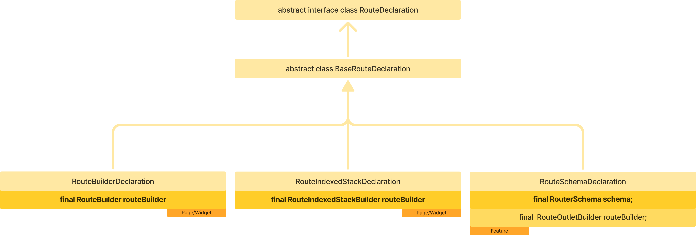

We cover all of these in the examples that follow.

### Declaration hierarchy

Supported declaration types and their responsibilities can be summarized in one diagram:

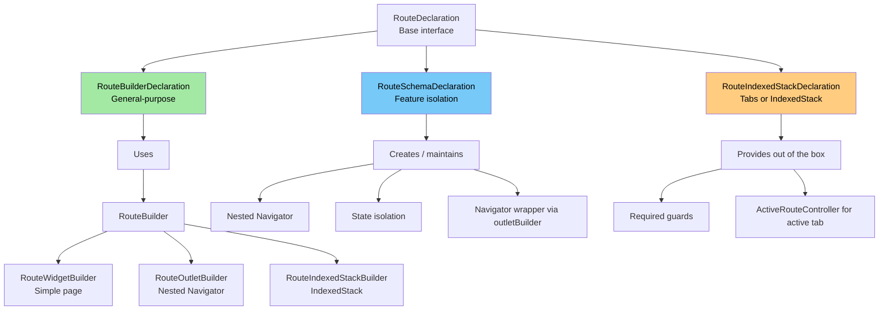
```mermaid
graph TD
    RouteDeclaration[RouteDeclaration<br/>Base interface]

    RouteDeclaration --> RouteBuilderDeclaration[RouteBuilderDeclaration<br/>General-purpose]
    RouteDeclaration --> RouteSchemaDeclaration[RouteSchemaDeclaration<br/>Feature isolation]
    RouteDeclaration --> RouteIndexedStackDeclaration[RouteIndexedStackDeclaration<br/>Tabs or IndexedStack]

    RouteBuilderDeclaration --> Uses[Uses]
    Uses --> RouteBuilder

    RouteBuilder --> RouteWidgetBuilder[RouteWidgetBuilder<br/>Simple page]
    RouteBuilder --> RouteOutletBuilder[RouteOutletBuilder<br/>Nested Navigator]
    RouteBuilder --> RouteIndexedStackBuilder[RouteIndexedStackBuilder<br/>IndexedStack]

    RouteSchemaDeclaration --> SchemaFeatures[Creates / maintains]
    SchemaFeatures --> NestedNav[Nested Navigator]
    SchemaFeatures --> Isolation[State isolation]
    SchemaFeatures --> OutletBuilder[Navigator wrapper via outletBuilder]

    RouteIndexedStackDeclaration --> IndexedFeatures[Provides out of the box]
    IndexedFeatures --> AutoGuards[Required guards]
    IndexedFeatures --> ActiveController[ActiveRouteController for active tab]

    classDef routeBuilderDeclaration fill:#a3e9a4,color:black
    classDef routeSchemaDeclaration fill:#77c9f7,color:black
    classDef routeIndexedStackDeclaration fill:#ffcc80,color:black

    class RouteBuilderDeclaration routeBuilderDeclaration
    class RouteSchemaDeclaration routeSchemaDeclaration
    class RouteIndexedStackDeclaration routeIndexedStackDeclaration
```

## RouteBuilderDeclaration

The most flexible declaration: it can use any `RouteBuilder`.

### General shape

```dart
RouteBuilderDeclaration(
  route: AppRoutes.someRoute,
  routeBuilder: /* RouteBuilder */,
  declarations: [ /* nested declarations */ ],
  guards: [ /* guards for navigation control */ ],
)
```

**Note:** In the examples below we use factory constructors on `RouteDeclaration`:

```dart
factory RouteDeclaration.routeBuilder -> RouteBuilderDeclaration
factory RouteDeclaration.scheme -> RouteSchemaDeclaration
factory RouteDeclaration.indexedStack -> RouteIndexedStackDeclaration
```

**Parameters:**

- `route` - the route handled by this declaration
- `routeBuilder` - how to build UI (widget / outlet / indexed)
- `declarations` - nested declarations (for outlet and indexed)
- `guards` - optional guard list for checks / navigation mutation

Next we look at which `RouteBuilder` variants pair with `RouteBuilderDeclaration`.

### 1. With `RouteWidgetBuilder`

Use for ordinary pages without nested navigation.

**When to use:**

- Simple pages with no child navigation

**Example:**

```dart
/// Profile page declaration
final profileDeclaration = RouteDeclaration.routeBuilder(
  route: AppRoutes.profile,
  routeBuilder: RouteBuilder.widget(
    builder: (context, routeNode) => SimplePage(
      title: 'Driver profile',
      backgroundColor: Colors.green[50],
    ),
  ),
);
```

**Full example:** [basic_widget_declaration.dart](../packages/yx_navigation_flutter/example/lib/src/route_declarations/01_basic_widget_declaration.dart)

**Note:** The example app already includes launch configurations for running these samples:

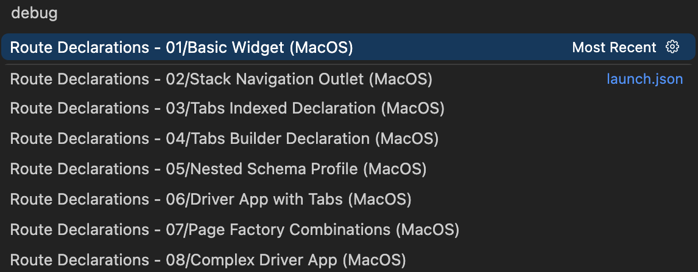

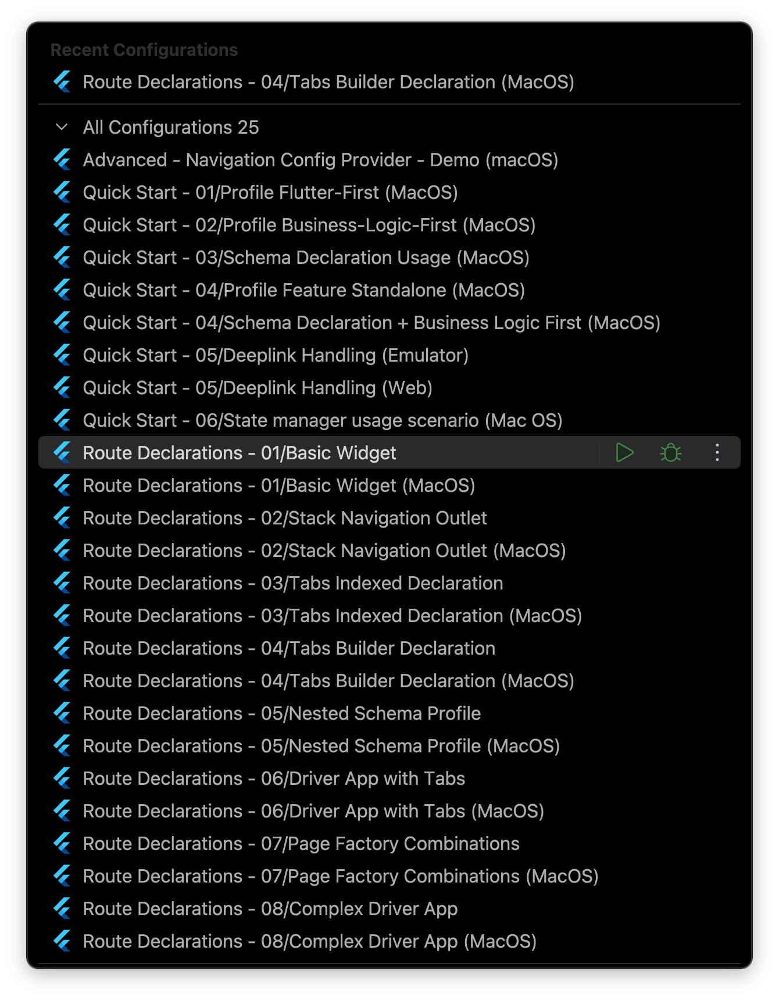

Run the sample to navigate to the listed routes. With the debug panel enabled, you can inspect
current navigation state:

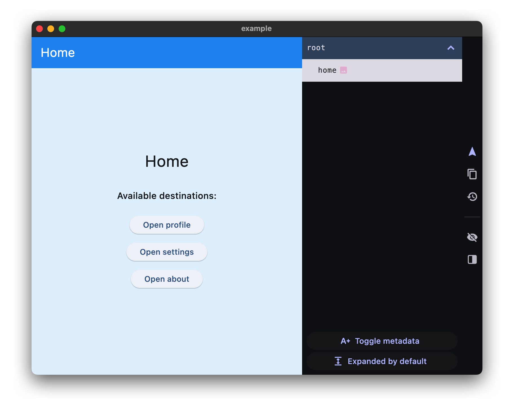

### 2. With `RouteOutletBuilder`

Creates a nested `NavigatorOutlet` that renders a page stack.

**When to use:**

- You need a page stack (classic Navigator)
- Sequential navigation inside a section (`push` for new screens, `pop` to go back)

**Structure:**

```dart
final homeDeclaration = RouteDeclaration.routeBuilder(
  route: AppRoutes.home,
  routeBuilder: RouteBuilder.outlet(
    outletBuilder: (context, routeNode, outlet) {
      // You can wrap outlet with an extra widget
      return Scaffold(
        appBar: AppBar(title: Text('Home')),
        body: outlet, // NavigatorOutlet
      );
    },
  ),
  declarations: [
    dashboardDeclaration,
    settingsDeclaration,
  ],
);
```

**Key points:**

- `RouteBuilder.outlet` returns an outlet widget (`NavigatorOutlet`) from `outletBuilder`. This is a
  classic Navigator that builds its page stack from the current node and its `RouteNode.children`.
- `outletBuilder` lets you wrap the `NavigatorOutlet` from the callback (for example with a
  `Scaffold`), or with `InheritedWidget` to inject data into the navigator subtree (`Theme`,
  `MediaQuery`, and so on).
- For the current navigation stack, `BuildContext` receives an isolated `NavigationController` that
  manages state for the current `RouteNode`.

**Full example:** [stack_navigation_outlet.dart](../packages/yx_navigation_flutter/example/lib/src/route_declarations/02_stack_navigation_outlet.dart)

Run this sample.
You will see the root navigator for the Root node and a nested navigator (`NavigatorOutlet`) for
`AppRoutes.home`.

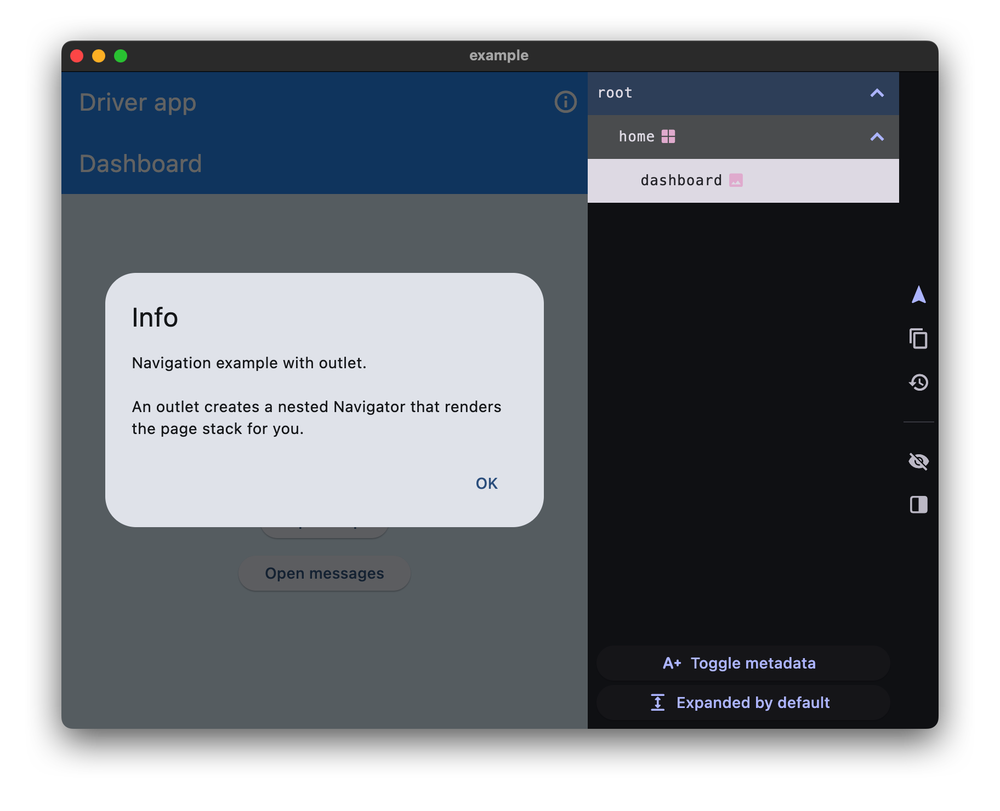
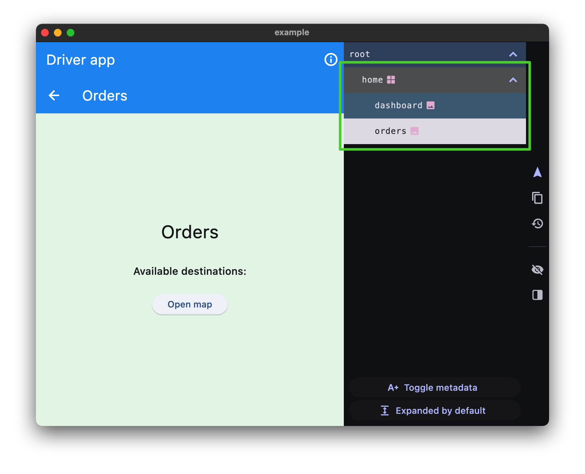

In this sample, `AppRoutes.home` is declared with `RouteOutletBuilder`:

```dart
/// Declaration for AppRoutes.home with nested outlet
///
/// RouteBuilder.outlet creates NavigatorOutlet,
/// which renders child pages as a stack.
///
/// outletBuilder lets you wrap the outlet with another widget,
/// for example to add a Scaffold with AppBar.
final homeDeclaration = RouteDeclaration.routeBuilder(
  route: AppRoutes.home,
  routeBuilder: RouteBuilder.outlet(
    outletBuilder: (context, routeNode, outlet) {
      // Wrap outlet in Scaffold for a shared AppBar
      return Scaffold(
        appBar: AppBar(
          title: const Text('Driver app'),
          actions: [
            IconButton(
              icon: const Icon(Icons.info_outline),
              onPressed: () {
                showDialog(
                  context: context,
                  builder: (context) => AlertDialog(
                    title: const Text('Info'),
                    content: const Text(
                      'This is an outlet navigation sample.\n\n'
                      'The outlet creates a nested Navigator '
                      'that renders a page stack.',
                    ),
                    actions: [
                      TextButton(
                        onPressed: () => Navigator.of(context).pop(),
                        child: const Text('OK'),
                      ),
                    ],
                  ),
                );
              },
              tooltip: 'Info',
            ),
          ],
        ),
        body: outlet, // Nested navigator
      );
    },
  ),
  declarations: [
    dashboardDeclaration,
    ordersDeclaration,
    mapDeclaration,
    messagesDeclaration,
  ],
);
```

### 3. With `RouteIndexedStackBuilder`

Builds an `IndexedStack` for tabs while preserving widget state.

**When to use:**

- You need `IndexedStack`, `TabBar`, or `PageView`
- You need more control over state
- Dynamic tabs (add/remove at runtime)
- Custom tab-switching logic

**Structure:**

```dart
final homeDeclaration = RouteDeclaration.routeBuilder(
  route: AppRoutes.home,
  routeBuilder: RouteBuilder.indexed(
    indexedBuilder: (context, routeNode, indexedStack, controller) {
      // controller - ActiveRouteController for the active tab
      final activeRoute = controller.activeRoute ?? AppRoutes.map;
      final tabs = [
        AppRoutes.map,
        AppRoutes.messages,
        AppRoutes.profile,
        AppRoutes.settings
      ];
      final currentIndex = tabs.indexOf(activeRoute);

      return Scaffold(
        body: indexedStack, // IndexedStack with tabs
        bottomNavigationBar: BottomNavigationBar(
          currentIndex: currentIndex,
          onTap: (index) => controller.setActiveRoute(tabs[index]),
          items: [ /* tabs */ ],
        ),
      );
    },
  ),
  declarations: [
    mapTabDeclaration,
    messagesTabDeclaration,
  ],
);
```

**⚠️ Important difference from `RouteIndexedStackDeclaration` (covered later with `RouteIndexedStackDeclaration`):**

- Guards are **not** created automatically
- The nested `declarations` list is mostly semantic. Creating matching `RouteNode` entries for the
  indexed stack is the developer's responsibility.
- Child nodes **must** be added to `RouteNode` manually. Initial state for the node rendered with
  `RouteIndexedStackBuilder` can be set in several ways - for example in `initialNodeBuilder` of the
  root or feature schema.

```dart
// In RouterSchema.initialNodeBuilder, explicitly set children when initializing state
// in the root schema or feature schema:
@override
RouteNode initialNodeBuilder(MutableRouteNode node) => node..setChildren([
  AppRoutes.home.toNode()..setChildren([
    AppRoutes.map.toNode(),
    AppRoutes.messages.toNode(),
  ]),
]);
```

Or via a `Guard`, as discussed elsewhere.

**Full example:** [tabs_builder_declaration.dart](../packages/yx_navigation_flutter/example/lib/src/route_declarations/04_tabs_builder_declaration.dart)

Run this sample.

You will see the root navigator for Root and a nested `Scaffold` with an `IndexedStack` in `body`
for `AppRoutes.home`.

The nested `IndexedStack` renders routes listed in the `children` collection of the current
`AppRoutes.home` node. Current node state is visible in the debug panel on the right.

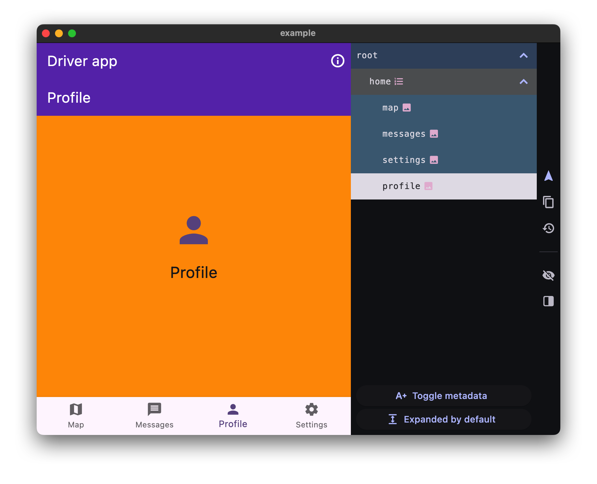

The declaration for `AppRoutes.home` looks like this:

```dart
/// Home declaration with RouteIndexedStackBuilder
///
/// Differences from RouteIndexedStackDeclaration:
/// 1. Uses RouteBuilderDeclaration instead of RouteIndexedStackDeclaration
/// 2. Guards are NOT created automatically
/// 3. Children MUST be filled manually in initialNodeBuilder
/// 4. Without auto-guards you get more flexible tab switching and dynamic tabs
///    (add/remove tabs at runtime).
final homeDeclaration = RouteDeclaration.routeBuilder(
  route: AppRoutes.home,
  routeBuilder: RouteBuilder.indexed(
    indexedBuilder: (context, routeNode, indexedStack, controller) {
      final activeRoute = controller.activeRoute ?? AppRoutes.map;
      final tabs = [
        AppRoutes.map,
        AppRoutes.messages,
        AppRoutes.profile,
        AppRoutes.settings,
      ];
      final currentIndex = tabs.indexOf(activeRoute);

      return Scaffold(
        appBar: AppBar(
        ...,
        body: indexedStack,
        bottomNavigationBar: BottomNavigationBar(
          currentIndex: currentIndex,
          onTap: (index) {
            controller.setActiveRoute(tabs[index]);
          },
          type: BottomNavigationBarType.fixed,
          items: const [
            BottomNavigationBarItem(
              icon: Icon(Icons.map),
              label: 'Map',
            ),
            ...,
          ],
        ),
      );
    },
  ),
  // Nested declarations
  declarations: [
    mapTabDeclaration,
    messagesTabDeclaration,
    profileTabDeclaration,
    settingsTabDeclaration,
  ],
);
```

In the `RouteBuilder.indexed` callback you receive the `indexedStack` widget for the active tab and
`controller` to set a new active route (`controller.setActiveRoute(tabs[index])`) or read the
current one (`controller.activeRoute`).

Important: for this sample to work and tabs to build, you must manually provide the nodes that
should be children of `home`.

```dart
/// App navigation schema
base class AppNavigationSchema extends RouterSchema {
  // IMPORTANT ⚠️: Children must be added MANUALLY!
  // RouteBuilderDeclaration does NOT create automatic guards,
  // so you must list all tab nodes in children explicitly
  @override
  RouteNode initialNodeBuilder(MutableRouteNode node) => node.copyWith(
        children: [
          AppRoutes.home.toNode(
            children: [
              // Explicitly add all tabs
              AppRoutes.map.toNode(),
              AppRoutes.messages.toNode(),
              AppRoutes.profile.toNode(),
              AppRoutes.settings.toNode(),
            ],
          ),
        ],
      );
```

## RouteSchemaDeclaration

This is a specialized declaration for wiring navigation schemas (separate `RouterSchema` instances,
each a concrete `Schema`) as isolated features.

### Purpose

**Feature isolation** works because each feature defines its own navigation schema that:

- can be developed independently
- keeps isolated navigation state
- can be reused across apps and nested inside other features

For example, one team builds a Map feature and another builds an Orders feature.

The Map feature can embed the Orders feature inside its own navigation schema.

In the host app you can mount the Map feature (`MapFeature`) into the app root schema. The overall
schema nesting may look like this:

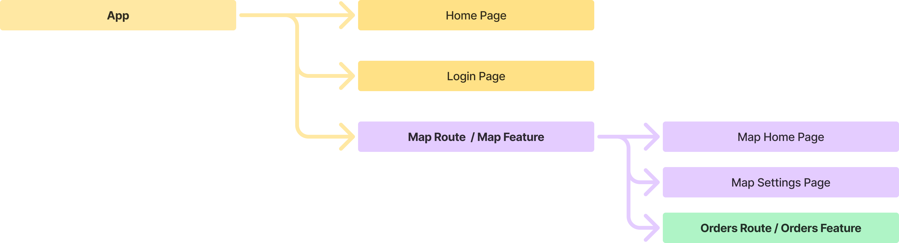

At some point (map loaded, user opens orders from it) the runtime navigation state tree may look
like this:

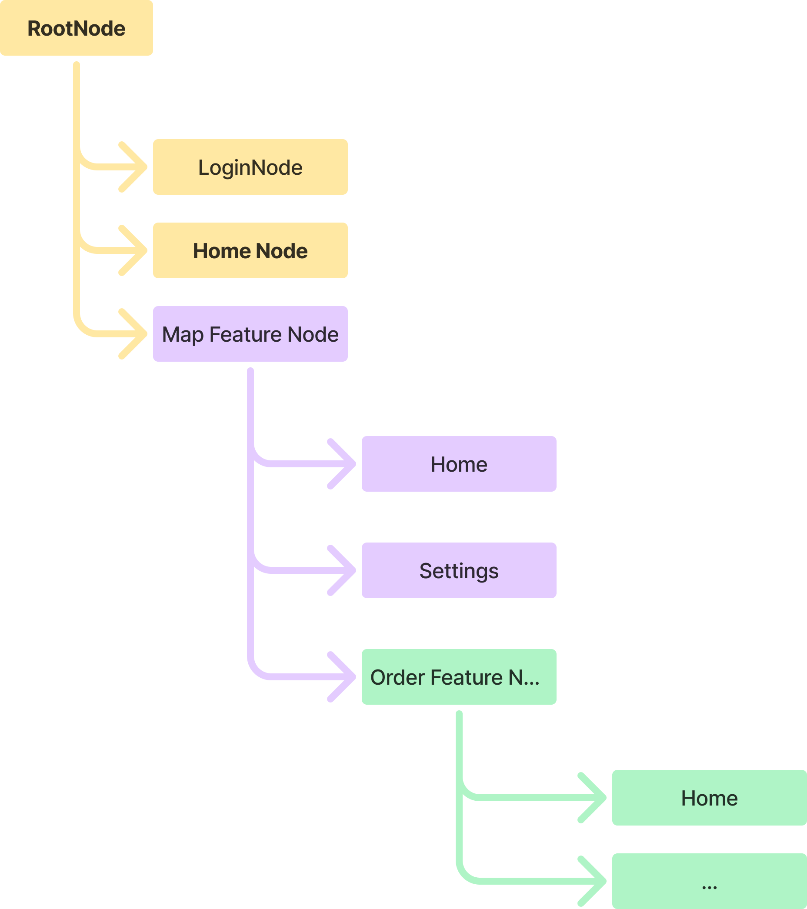

### Shape

A typical integration looks like this:

```dart
final profileSchemaDeclaration = RouteDeclaration.scheme(
  route: AppRoutes.profile,
  schema: ProfileNavigationSchema(), // Ready-made schema
  outletBuilder: (context, routeNode, outlet) {
    // Usually you get a nested navigator (NavigatorOutlet) for the given schema
    // You can also wrap outlet, e.g. with InheritedWidget for DI
    return ProfileDependenciesScope(
      dependencies: profileDependencies,
      child: outlet,
    );
  },
);
```

### Key characteristics

#### 1. Automatic nested Navigator

`RouteSchemaDeclaration` **always** creates a nested navigator via `RouteBuilder.outlet`.

#### 2. State isolation

For the nested schema, an isolated `NavigationController.node` is created that only controls its own
branch of state

```dart
  /// The navigation controller for this navigator.
  /// If this controller is not specified
  /// the new instance of [NavigationController] will be created and
  /// pushed down to the widget subtree
  final NavigationController? _navigationController;
```

You can also pass a specific instance explicitly - the Business Logic First scenario:

```dart
final profileSchemaDeclaration = RouteDeclaration.scheme(
  route: AppRoutes.profile,
  schema: ProfileNavigationSchema(),
  navigationController: /* Pass NavigationController here,
                           created via `NavigationController.node`
                           bound to the host app's RouteNodeStateManager */,
```

**Note:** `NavigationController.node` is created not only for `RouteSchemaDeclaration`, but
whenever a `NavigatorOutlet` widget is created for a navigation stack. For example, using
`RouteOutletBuilder` inside `RouteBuilderDeclaration` also gets its own `NavigationController`.

#### 3. `outletBuilder` for DI

`outletBuilder` lets you wrap the nested schema to inject dependencies:

```dart
outletBuilder: (context, routeNode, outlet) {
  // Read dependencies from parent scope
  final parentDeps = ParentDependenciesScope.of(context);

  // Build isolated feature dependencies
  return FeatureDependenciesScope.embedded(
    parentApi: parentDeps.api,
    child: outlet,
  );
}
```

### Feature design: Standalone and Embedded modes

[Quick start](quick_start.md) shows how to keep a navigation schema isolated.

In general, a feature should support both modes:

**Standalone** - the feature runs as its own app. It uses a root `RouteNodeStateManager` you pass when
building `RouterConfig`.

```dart
// feature example/main.dart
final stateManager = RouteNodeStateManager(...);
final schema = FeatureNavigationSchema();
final config = schema.build(stateManager: stateManager);

runApp(MaterialApp.router(routerConfig: config));
```

**Embedded** - the feature is mounted in a parent app. It does not create its own `RouteNodeStateManager`;
it reuses the one provided by the parent.

```dart
// In parent app
RouteDeclaration.scheme(
  route: AppRoutes.feature,
  schema: FeatureNavigationSchema(),
  outletBuilder: (context, routeNode, outlet) {
    return FeatureDependenciesScope.embedded(
      navigationController: /* Pass controller here,
                                created via `NavigationController.node`
                                with parent RouteNodeStateManager or parent feature NavigationController */,
      child: outlet,
    );
  },
)
```

See [Quick start](quick_start.md) for more on isolation.

### When to use

✅ **Use `RouteSchemaDeclaration` when:**

- you integrate a ready feature from another package
- you need full navigation state isolation
- the feature is owned by another team
- you need reuse across multiple apps

❌ **Avoid it when:**

- you only need simple nested navigation without isolation. For `nested navigation`, a
  `RouteBuilderDeclaration` with `routeBuilder: RouteBuilder.outlet()` may be enough.
- everything lives in one module
- you do not need standalone mode

**Full example:** [nested_schema_profile.dart](../packages/yx_navigation_flutter/example/lib/src/route_declarations/05_nested_schema_profile.dart)

Run this sample. It reuses the profile feature connected via `RouteSchemaDeclaration`:

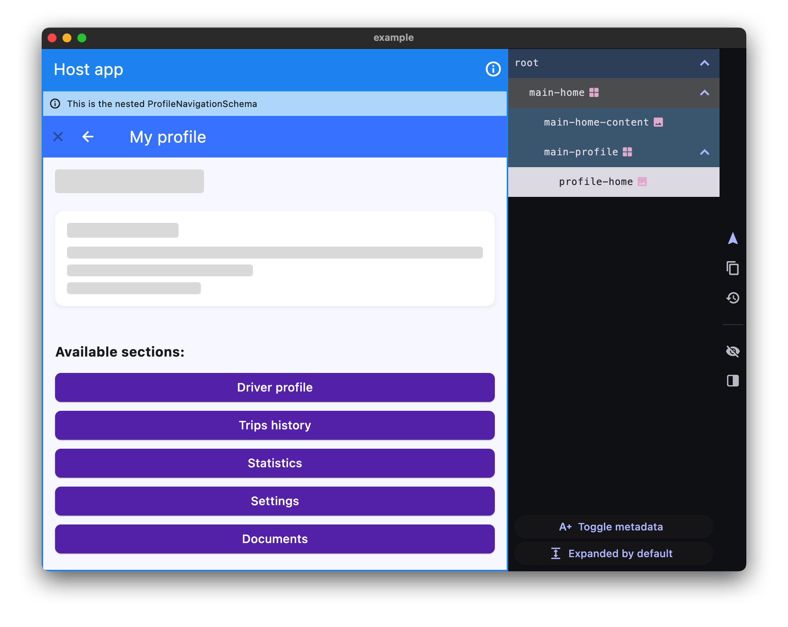

The declaration for opening Profile looks like this:

```dart
/// Profile as a nested schema
///
/// RouteDeclaration.scheme:
/// - Creates nested navigator for ProfileNavigationSchema
/// - Isolates profile navigation state
/// - outletBuilder can wrap the schema with an extra widget
final profileSchemaDeclaration = RouteDeclaration.scheme(
  route: AppRoutes.profile,
  schema: ProfileNavigationSchema(),
  // outletBuilder can wrap the nested schema outlet
  // For example, add InheritedWidget for passing data
  outletBuilder: (context, routeNode, outlet) {
    return Container(
      decoration: BoxDecoration(
        border: Border.all(color: Colors.blue, width: 2),
      ),
      child: Column(
        children: [
          Container(
            color: Colors.blue.shade100,
            padding: const EdgeInsets.all(8),
            child: const Row(
              children: [
                Icon(Icons.info_outline, size: 16),
                SizedBox(width: 8),
                Text(
                  'Nested ProfileNavigationSchema',
                  style: TextStyle(fontSize: 12),
                ),
              ],
            ),
          ),
          Expanded(child: outlet),
        ],
      ),
    );
  },
);
```

## RouteIndexedStackDeclaration

This is a dedicated declaration type for `IndexedStack` / `TabBar` scenarios. Unlike
`RouteBuilderDeclaration` combined with `RouteIndexedStackBuilder`, navigating to the route declared
here automatically creates child nodes for the current node in the state tree.

Those child nodes are derived from nested `declarations`. That removes the need to hand-tune
`initialNodeBuilder` and manually fill `RouteNode.children` with every route you want inside the
`IndexedStack`.

### Purpose

Automates `IndexedStack` / `TabBar` setup with minimal code.

### Shape

```dart
final homeDeclaration = RouteDeclaration.indexedStack(
  route: AppRoutes.home,
  routeBuilder: RouteIndexedStackBuilder(
    indexedBuilder: (context, routeNode, indexedStack, controller) {
      return Scaffold(
        body: indexedStack,
        bottomNavigationBar: BottomNavigationBar(
          currentIndex: tabs.indexOf(controller.activeRoute),
          onTap: (index) => controller.setActiveRoute(tabs[index]),
          items: [ /* tabs */ ],
        ),
      );
    },
  ),
  declarations: [
    // From nested declarations: when opening AppRoutes.home, two child nodes
    // for Map and Messages are created automatically
    mapTabDeclaration,
    messagesTabDeclaration,
  ],
);
```

### Automatic guards (details)

**The key trait of this declaration:** `RouteIndexedStackDeclaration` automatically creates guards that:

- ensure all `declarations` children exist in state
- keep state aligned with declarations

So `initialNodeBuilder` can list only the tabs you need at startup:

```dart
@override
RouteNode initialNodeBuilder(MutableRouteNode node) => node..setChildren([
  AppRoutes.home.toNode(), // Others (map, messages) are added automatically via guards
]);
```

or

```dart
@override
RouteNode initialNodeBuilder(MutableRouteNode node) => node..setChildren([
  AppRoutes.home.toNode()..setChildren([
    // You can list only active tabs
    // Others are added automatically via guards
    AppRoutes.map.toNode(),
  ]),
]);
```

### `ActiveRouteController`

The `indexedBuilder` callback receives `controller` for the active tab.

You can use it as follows:

```dart
// Read current active route
final activeRoute = controller.activeRoute;

// Set active route
controller.setActiveRoute(AppRoutes.messages);

// Check whether route is active
final isActive = controller.isRouteActive(AppRoutes.map);
```

### IndexedStack and tab state retention

The `IndexedStack` you get keeps all tab widget state using:

- `Offstage` - hides inactive tabs
- `TickerMode` - pauses animations in inactive tabs

```dart
// Inside RouteNodeIndexedStack
IndexedStack(
  index: activeIndex,
  children: tabs.map((tab) {
    return Offstage(
      offstage: !isTabActive(tab),
      child: TickerMode(
        enabled: isTabActive(tab),
        child: tabWidget,
      ),
    );
  }).toList(),
)
```

### When to use

✅ **Use `RouteIndexedStackDeclaration` when:**

- you need static tabs (fixed list)
- you want automatic guards
- you want minimal tab code
- you use `TabBar` / `IndexedStack` / `BottomNavigationBar`

❌ **Prefer `RouteBuilderDeclaration` + indexed when:**

- you need dynamic tabs (add/remove). You own `RouteNode.children` and all validation yourself.
- you need tighter state control
- you need custom guard logic
- tab switching logic is complex

**Full example:** [tabs_indexed_declaration.dart](../packages/yx_navigation_flutter/example/lib/src/route_declarations/03_tabs_indexed_declaration.dart)

Run this sample.

You will see the root navigator for Root and a nested `Scaffold` with `IndexedStack` in `body` for
`AppRoutes.home`.

The nested `IndexedStack` renders routes from the `children` collection of the current node - node
state is visible in the debug panel on the right.

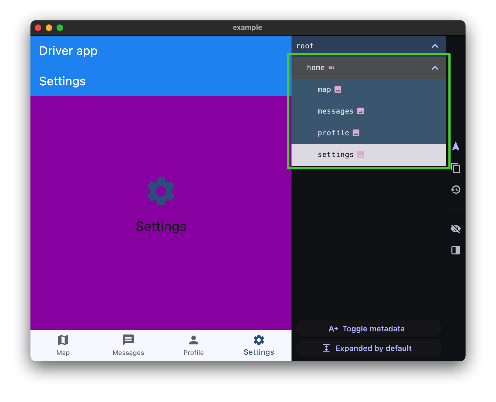

The declaration for `AppRoutes.home` looks like this:

```dart
/// Home with IndexedStack
///
/// RouteDeclaration.indexedStack automatically:
/// - Creates guards to manage children
/// - Provides ActiveRouteController for tab switching
/// - Preserves each tab's state
final homeDeclaration = RouteDeclaration.indexedStack(
  route: AppRoutes.home,
  routeBuilder: RouteIndexedStackBuilder(
    indexedBuilder: (context, routeNode, indexedStack, controller) {
      // Read current active route
      final activeRoute = controller.activeRoute ?? AppRoutes.map;
      final tabs = [
        AppRoutes.map,
        AppRoutes.messages,
        AppRoutes.profile,
        AppRoutes.settings
      ];
      final currentIndex = tabs.indexOf(activeRoute);

      return Scaffold(
        appBar: AppBar(
          title: const Text('Driver app'),
        ),
        body: indexedStack, // IndexedStack with tabs
        bottomNavigationBar: BottomNavigationBar(
          currentIndex: currentIndex,
          onTap: (index) {
            // Switch active route via controller
            controller.setActiveRoute(tabs[index]);
          },
          type: BottomNavigationBarType.fixed,
          items: const [
            BottomNavigationBarItem(
              icon: Icon(Icons.map),
              label: 'Map',
            ),
            ...
          ],
        ),
      );
    },
  ),
  // Nested declarations are tabs
  // RouteIndexedStackDeclaration creates guards automatically
  // to manage these children
  declarations: [
    mapTabDeclaration,
    messagesTabDeclaration,
    profileTabDeclaration,
    settingsTabDeclaration,
  ],
);
```

Unlike [tabs_builder_declaration.dart](../packages/yx_navigation_flutter/example/lib/src/route_declarations/04_tabs_builder_declaration.dart), we do not rely on `initialNodeBuilder` for every tab child - nodes for map, messages, profile, and settings are created automatically:

```dart
/// App navigation schema
base class AppNavigationSchema extends RouterSchema {
  // Initial state: Home with all tabs
  // RouteIndexedStackDeclaration creates children automatically
  @override
  RouteNode initialNodeBuilder(MutableRouteNode node) => node.copyWith(
        children: [
          AppRoutes.home.toNode(),
        ],
      );
```

## Which declaration type to use / comparison table

Below is a comparison of what you get from each supported declaration type:

| Characteristic                         | RouteBuilderDeclaration       | RouteSchemaDeclaration           | RouteIndexedStackDeclaration  |
| -------------------------------------- | ----------------------------- | -------------------------------- | ----------------------------- |
| **Route builder**                      | Any (widget / outlet / indexed) | Outlet only (fixed)            | Indexed only (fixed)          |
| **Purpose**                            | General-purpose               | Feature / module isolation     | Simplified tabs               |
| **Nested navigator**                   | Depends on builder            | Yes (required)                   | No                            |
| **Auto guards**                        | No                            | Yes (from schema)              | Yes (for children)            |
| **State isolation**                    | Depends on builder            | Yes (`NavigationController.node`) | Partial                   |
| **`outletBuilder`**                    | Yes (if outlet)               | Yes                              | No                            |
| **Manual `children` control**          | Yes (for indexed)             | No                               | No                            |
| **Standalone support**                 | No                            | Yes (via schema)               | No                            |
| **Complexity**                         | Medium                        | High                             | Low                           |
| **Flexibility**                        | Maximum                       | Limited                          | Limited                       |

# Additional declaration capabilities

## Page factory

`PageFactory` defines how `RouteBuilder` creates a Flutter `Page` for a route.

### What is `PageFactory`

To define your own `PageFactory`, implement this contract:

```dart
abstract interface class PageFactory<T> {
  Page<T> call(
    BuildContext context,
    RouteNode routeNode,
    LocalKey key,
    Widget child,
  );
}
```

### Built-in `PagesFactory` in yx_navigation

yx_navigation ships ready-made implementations via `PagesFactory`:

#### 1. Material (default)

```dart
RouteBuilder.widget(
  builder: (context, routeNode) => MyPage(),
  // pageFactory omitted = PagesFactory.material()
)

// Explicit
RouteBuilder.widget(
  builder: (context, routeNode) => MyPage(),
  pageFactory: const PagesFactory.material(),
)

// With fullscreenDialog
RouteBuilder.widget(
  builder: (context, routeNode) => DialogPage(),
  pageFactory: const PagesFactory.material(
    fullscreenDialog: true,
  ),
)
```

#### 2. Cupertino

```dart
RouteBuilder.widget(
  builder: (context, routeNode) => SettingsPage(),
  pageFactory: const PagesFactory.cupertino(),
)
```

#### 3. Custom `PageFactory`

For custom animations and transitions, use `PagesFactory.custom`:

```dart
RouteBuilder.widget(
  builder: (context, routeNode) => MyPage(),
  pageFactory: PagesFactory.custom(
    builder: (context, routeNode, key, child) {
      return _CustomTransitionPage(
        key: key,
        name: routeNode.route.id,
        child: child,
      );
    },
  ),
)

// Custom Page implementation
class _CustomTransitionPage extends Page {
  final Widget child;

  const _CustomTransitionPage({
    required this.child,
    required super.key,
    required super.name,
  });

  @override
  Route createRoute(BuildContext context) {
    return PageRouteBuilder(
      settings: this,
      pageBuilder: (context, animation, secondaryAnimation) => child,
      transitionsBuilder: (context, animation, secondaryAnimation, child) {
        return FadeTransition(
          opacity: animation,
          child: ScaleTransition(
            scale: Tween<double>(begin: 0.8, end: 1.0).animate(animation),
            child: child,
          ),
        );
      },
    );
  }
}
```

### Modal dialog route

For modal dialogs, use `DialogPage` with `DialogRoute`:

```dart
// DialogPage
class DialogPage<T> extends Page<T> {
  final Widget child;
  final Color? barrierColor;
  final bool barrierDismissible;

  const DialogPage({
    required this.child,
    this.barrierColor = Colors.black54,
    this.barrierDismissible = true,
    super.key,
    super.name,
  });

  @override
  Route<T> createRoute(BuildContext context) {
    return DialogRoute<T>(
      context: context,
      builder: (context) => child,
      barrierColor: barrierColor,
      barrierDismissible: barrierDismissible,
      settings: this,
    );
  }
}

// Use in a declaration
final dialogDeclaration = RouteDeclaration.routeBuilder(
  route: AppRoutes.dialog,
  routeBuilder: RouteBuilder.widget(
    builder: (context, routeNode) => Dialog(
      child: /* dialog content */,
    ),
    pageFactory: PagesFactory.custom(
      builder: (context, routeNode, key, child) {
        return DialogPage(
          key: key,
          name: routeNode.route.id,
          child: child,
        );
      },
    ),
  ),
);
```

**Compared to `fullscreenDialog`:**

- `fullscreenDialog: true` - regular full-screen page with bottom-to-top animation
- `DialogPage` - modal dialog over content with a barrier

### Reusing builders

The same `RouteWidgetBuilder` can be paired with different `PageFactory` values:

```dart
// Shared builder
RouteWidgetBuilder pageBuilder = (context, routeNode) => MyPage();

// Declarations with different transitions
final declaration1 = RouteDeclaration.routeBuilder(
  route: AppRoutes.page1,
  routeBuilder: RouteBuilder.widget(
    builder: pageBuilder,
    pageFactory: const PagesFactory.material(),
  ),
);

final declaration2 = RouteDeclaration.routeBuilder(
  route: AppRoutes.page2,
  routeBuilder: RouteBuilder.widget(
    builder: pageBuilder,
    pageFactory: const PagesFactory.cupertino(),
  ),
);

final declaration3 = RouteDeclaration.routeBuilder(
  route: AppRoutes.page3,
  routeBuilder: RouteBuilder.widget(
    builder: pageBuilder,
    pageFactory: PagesFactory.custom(
      builder: (context, routeNode, key, child) => /* custom */,
    ),
  ),
);
```

**Full example:** [page_factory_combinations.dart](../packages/yx_navigation_flutter/example/lib/src/route_declarations/07_page_factory_combinations.dart)

Run this sample to compare supported `PageFactory` types at runtime:

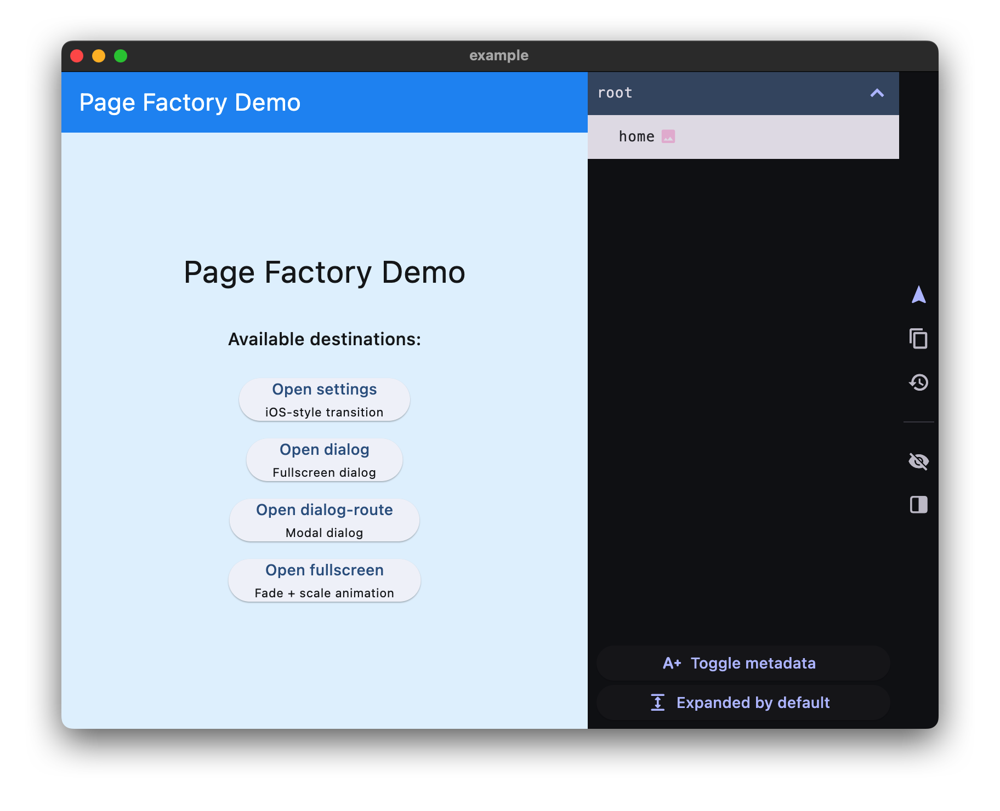
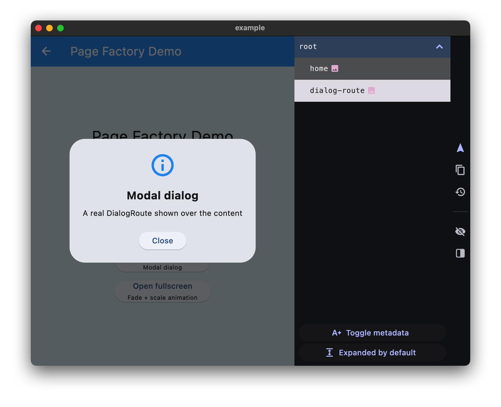

> **Note:** For guards - the mechanism that controls navigation state mutations - see
> [Guards](guards.md).

## Best Practices

### 1. How to pick a declaration type

Use this decision flow:

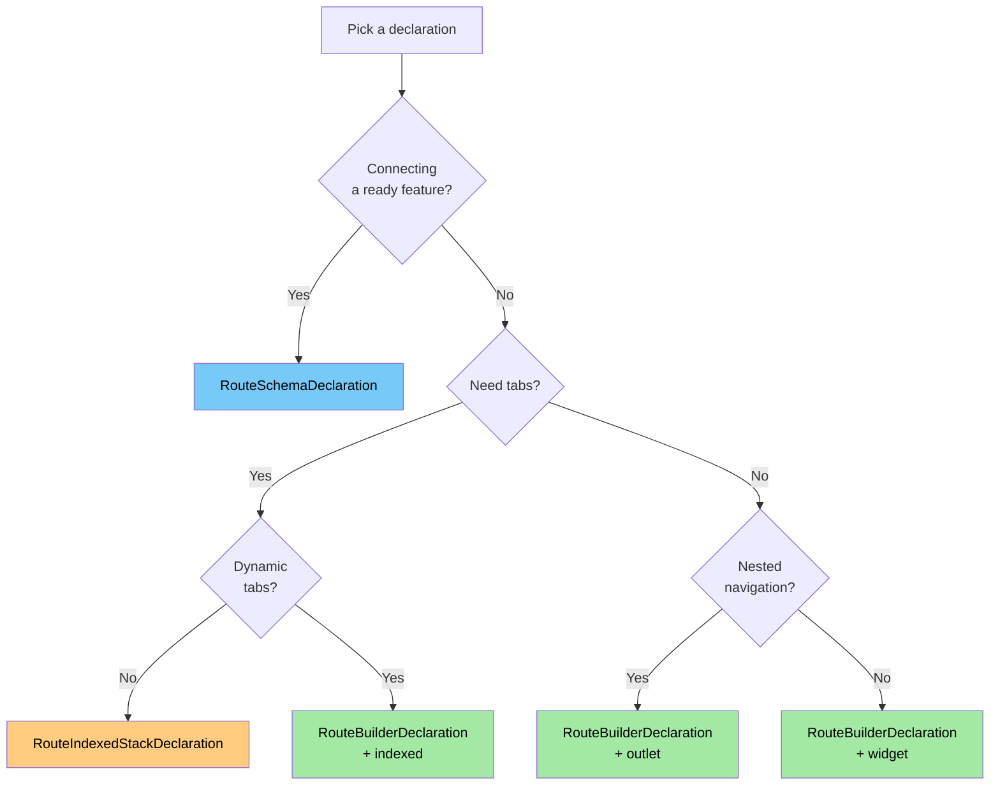
```mermaid
graph TD
    Start[Pick a declaration]

    Start --> Q1{Connecting<br/>a ready feature?}
    Q1 -->|Yes| SchemaDecl[RouteSchemaDeclaration]
    Q1 -->|No| Q2{Need tabs?}

    Q2 -->|Yes| Q3{Dynamic<br/>tabs?}
    Q3 -->|No| IndexedDecl[RouteIndexedStackDeclaration]
    Q3 -->|Yes| BuilderIndexed[RouteBuilderDeclaration<br/>+ indexed]

    Q2 -->|No| Q4{Nested<br/>navigation?}
    Q4 -->|Yes| BuilderOutlet[RouteBuilderDeclaration<br/>+ outlet]
    Q4 -->|No| BuilderWidget[RouteBuilderDeclaration<br/>+ widget]

    classDef schemaDecl fill:#77c9f7,color:black
    classDef indexedDecl fill:#ffcc80,color:black
    classDef builderIndexed fill:#a3e9a4,color:black
    classDef builderOutlet fill:#a3e9a4,color:black
    classDef builderWidget fill:#a3e9a4,color:black

    class SchemaDecl schemaDecl
    class IndexedDecl indexedDecl
    class BuilderIndexed builderIndexed
    class BuilderOutlet builderOutlet
    class BuilderWidget builderWidget
```

### 2. Using guards in declarations

You can attach guards on declarations to control navigation. Details: [Guards](guards.md).

```dart
RouteDeclaration.routeBuilder(
  route: AppRoutes.someRoute,
  guards: const [
    AuthGuard(),
    TabInitGuard(tabRoute: AppRoutes.someTab, childRoute: AppRoutes.content),
  ],
  routeBuilder: /* ... */,
)
```

### 3. Naming routes well

Cross-feature route id collisions are not fully solved yet.

For now, prefer **unique, descriptive** route ids to avoid runtime clashes when two or more routes
share the same id:

```dart
// ✅ Good - descriptive ids with prefixes
abstract class AppRoutes {
  static const home = YxRoute(id: 'home');
  static const profileHome = YxRoute(id: 'profile-home');
  static const profileSettings = YxRoute(id: 'profile-settings');
}

// ❌ Bad - short opaque ids
abstract class AppRoutes {
  static const h = YxRoute(id: 'h');
  static const ps = YxRoute(id: 'ps');
}
```

## More examples

### Tabbed app

**Full example:** [driver_app_with_tabs_and_profile.dart](../packages/yx_navigation_flutter/example/lib/src/route_declarations/06_driver_app_with_tabs_and_profile.dart)

This sample shows tabs, nested navigation, and reusing the profile feature in its own tab.

````dart
/// Example 6: Driver app with TabBar and nested Profile schema
///
/// Combined sample:
/// - Root outlet for Home and Authentication
/// - TabBar with BottomNavigationBar (via RouteIndexedStackDeclaration)
/// - Nested profile schema in one tab
///
/// Navigation structure:
/// ```
/// Root (outlet)
///   Home (IndexedStack - tabs)
///     TabBar: Map | Messages | Profile | Settings
///     - Map Tab
///     - Messages Tab (with nested navigation)
///     - Profile Tab (RouteDeclaration.scheme)
///         ProfileNavigationSchema
///           - Profile Home
///           - Driver Profile
///           - Trips History
///           - Statistics
///           - Settings
///           - Documents
///     - Settings Tab
///   Authentication
/// ```
///
/// Key ideas:
/// - Mix of declaration types
/// - TabBar with nested schema in one tab
/// - Isolated profile navigation state
/// - Realistic driver app scenario
````

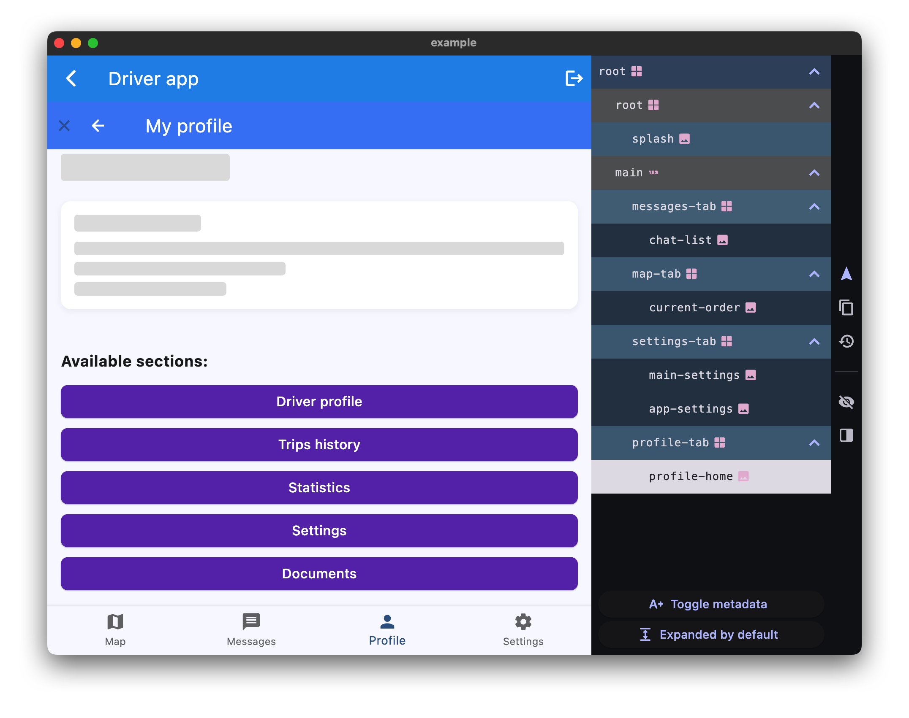

For modular architecture, embed features in the host app as separate navigation schemas:

```dart
// Use RouteSchemaDeclaration for features
class MainNavigationSchema extends RouterSchema {
  @override
  Iterable<RouteDeclaration> get declarations => [
        // Root navigation
        RouteDeclaration.routeBuilder(
          route: AppRoutes.root,
          routeBuilder: RouteBuilder.outlet(...),
          declarations: [
            // Mount features as schemas
            RouteDeclaration.scheme(
              route: AppRoutes.profile,
              schema: ProfileNavigationSchema(),
            ),
            RouteDeclaration.scheme(
              route: AppRoutes.orders,
              schema: OrdersNavigationSchema(),
            ),
          ],
        ),
      ];
}

final mainSchema = MainNavigationSchema();
```

### Full-featured app

See the full composite sample: [complex_driver_app.dart](../packages/yx_navigation_flutter/example/lib/src/route_declarations/08_complex_driver_app.dart)

It combines:

- Root outlet with authentication
- TabBar with four tabs
- Nested navigation inside tabs
- Embedded profile schema
- Guards and Business Logic First

Run this sample to see multiple declaration types, the guard mechanism (see [Guards](guards.md)),
nested declarations, and tab support.

````dart
/// Example 8: Full driver app
///
/// End-to-end sample combining techniques from earlier examples:
/// - RouteBuilderDeclaration with different builders
/// - RouteIndexedStackDeclaration for tabs
/// - RouteSchemaDeclaration for nested features
/// - Guards for auth checks
/// - Business Logic First
///
/// Navigation structure:
/// ```
/// Root (outlet)
///   Splash (auth check)
///   Authentication (outlet)
///     - Login
///     - Register
///     - Restore password
///   Main (IndexedStack - tabs)
///     Tabs: Map | Messages | Profile | Settings
///     - Map Tab (outlet)
///         - Current Order
///         - Order History
///     - Messages Tab (outlet)
///         - Chat List
///         - Chat Details
///     - Profile Tab (Schema)
///         ProfileNavigationSchema
///     - Settings Tab (outlet)
///         - Main Settings
///         - App Settings
///         - About
/// ```
````

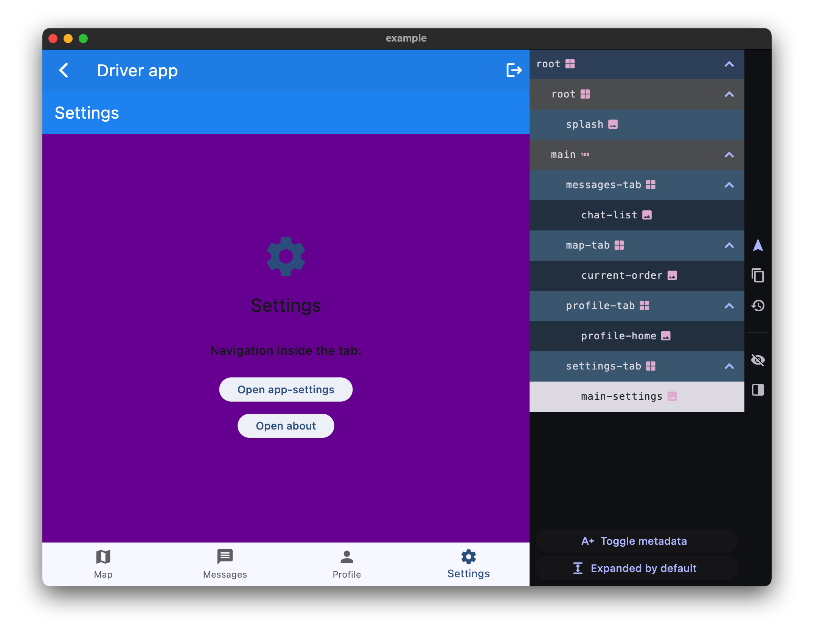
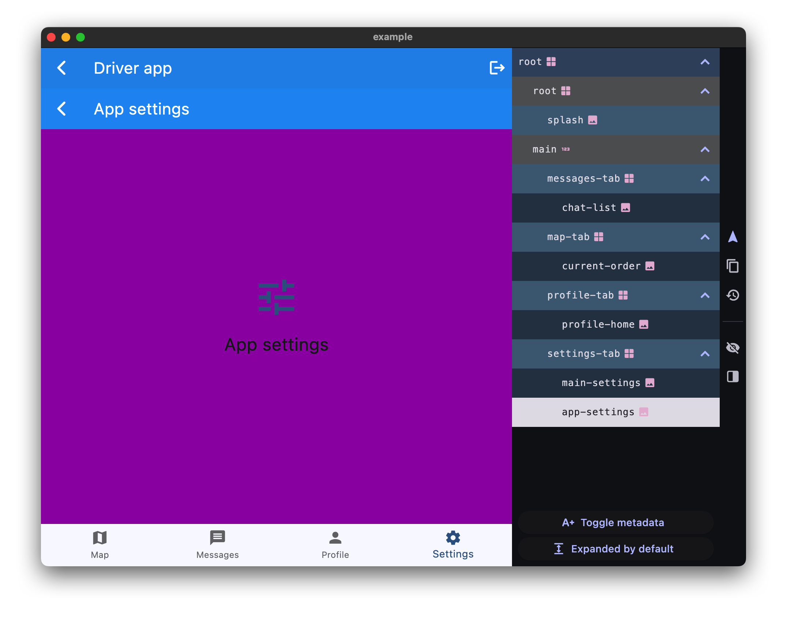

## See also

- [Guards](guards.md) - controlling navigation state mutations
- [Architecture - quick start](quick_architecture.md)
- [Quick start - usage examples](quick_start.md)
- [Declaration examples](../packages/yx_navigation_flutter/example/lib/src/route_declarations/)
